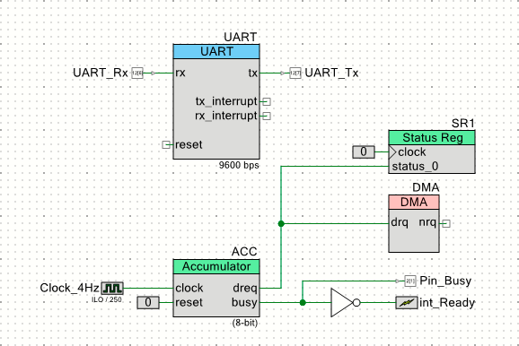

# Accumulator Component Creation

An accumulator component is created as a simple example component using the datapath.
This component uses the **FIFO** in the **Input Mode** and supports **DMA**.




## Accumulator Compoenent (Accumulator8_v1_0)

The accumulation is a word meaning adding input values into a storage.
The accumulator indicates a mechanism to calculate a sum of input value.


### Symbol file (Accumulator8_v1_0.cysym)

Following is the symbol of the accumulator component.


The "addend" values to be added are received by the **FIFO**.
When a value is written to the **FIFO** of the datapath, an addition behavior begins.

The accumulated value is store into the **A0** register of the datapath.
An accumulated value is gotten from the **A0** register after all data are written to the **FIFO**

The accumulator has two output signal `dreq` and `busy`.
The `dreq` signal indicates that a new value can be written to the **FIFO**. (FIFO not full)
The `busy` signal indicates that the accumulator has not processed all data written to the **FIFO*. (FIFO not empty)


### Verilog file (Accumulator8_v1_0.v)

The Accumulator component is described in **Verilog**.
The component consists of a statemachine with three states and a datapath.
累算器は、**Verilog**で記述されています。

```verilog:Accumulator8_v1_0.v
module Accumulator8_v1_0 (
	output  dreq,
    output  busy,
	input   clock,
	input   reset
);

//`#start body` -- edit after this line, do not edit this line

// State code declaration
localparam      ST_IDLE = 2'b00;
localparam      ST_GET  = 2'b01;
localparam      ST_ADD  = 2'b11;

// Datapath function declaration
localparam      CS_IDLE = 3'b000;
localparam      CS_ADD  = 3'b001;

// Wire declaration
wire[1:0]       state;          // State code
wire            f0_empty;       // F0 is EMPTY
wire            f0_not_full;    // F0 is NOT FULL

// Pseudo register
reg[2:0]        addr;           // Datapath function
reg             d0_load;        // LOAD FIFO into D0
reg             busy_reg;       // BUSY output flag
```

In the first part, there are declarations of `localparam`, `wire`, and `reg`.
The `localparam` labels begins with `ST_` indicates the state code of the statemachine.
And the labels begins with `CS_` indicates the address given to the configuration RAM of the datapath.

```verilog:Accumulator8_v1_0.v
// State machine behavior
reg [1:0]       state_reg;
always @(posedge clock or posedge reset) begin
    if (reset) begin
        state_reg <= ST_IDLE;
    end else casez(state)
        ST_IDLE: begin      // Wait for FIFO not empty
            if (~f0_empty) begin
                state_reg <= ST_GET;
            end
        end
        ST_GET: begin       // Pull FIFO into D0
            state_reg <= ST_ADD;
        end
        ST_ADD: begin       // Add D0 into A0
            if (~f0_empty) begin
                state_reg <= ST_GET;
            end else begin
                state_reg <= ST_IDLE;
            end
        end
        default: begin      // Unidentified state
            state_reg <= ST_IDLE;
        end
    endcase
end
assign          state = state_reg;
```

The state code of the statemachine is described as 2-bit codes.
Three states are declared and the rest state is undefined.
The statemachine bhaves as follows.

- In the `ST_IDLE` state, wait for a data arrived at **FIFO**.
When a data arrived, make a transition to the `ST_GET` state.
- In the `ST_GET` state, store a data pulled from the **FIFO** into the **D0** register and make a transition to the `ST_ADD` state.
- In the `ST_ADD` state, add the values in the **A0** and the **D0** registers and store the sum into the **A0** register.
Make a transition to the `ST_GET` state if the **FIFO** has data and make a transition to the `ST_IDLE` state if **FIFO** has no data.

```verilog:Accumulator8_v1_0.v
// Internal control signals
always @(state) begin
    casez (state)
        ST_IDLE: begin
            addr = CS_IDLE;
            d0_load = 1'b0;
            busy_reg = 1'b0;
        end
        ST_GET: begin
            addr = CS_IDLE;
            d0_load = 1'b1;
            busy_reg = 1'b1;
        end
        ST_ADD: begin
            addr = CS_ADD;
            d0_load = 1'b0;
            busy_reg = 1'b1;
        end
        default: begin
            addr = CS_IDLE;
            d0_load = 1'b0;
            busy_reg = 1'b0;
        end
    endcase
end

// Data request output
assign      dreq = f0_not_full;

// BUSY status flag
assign      busy = busy_reg;
```

All internal signals are specified by the statemachine's state.

- The `addr` signal is used to specify the Configurarion RAM address of the datapath.
- The `d0_load` signal provides a timing to store the value of **FIFO** into the `D0` register.
- The `busy_reg` signal is asserted when the accumulator is calculating the accumulation.
This signal is also used as the `busy` output.
- The datapath's "FIFO0 not FULL" signal is used as the `dreq` output.


```verilog:Accumulator8_v1_0.v
cy_psoc3_dp8 #(.cy_dpconfig_a(
{
    `CS_ALU_OP_PASS, `CS_SRCA_A0, `CS_SRCB_D0,
    `CS_SHFT_OP_PASS, `CS_A0_SRC_NONE, `CS_A1_SRC_NONE,
    `CS_FEEDBACK_DSBL, `CS_CI_SEL_CFGA, `CS_SI_SEL_CFGA,
    `CS_CMP_SEL_CFGA, /*CFGRAM0: IDLE: Hold*/
    `CS_ALU_OP__ADD, `CS_SRCA_A0, `CS_SRCB_D0,
    `CS_SHFT_OP_PASS, `CS_A0_SRC__ALU, `CS_A1_SRC_NONE,
    `CS_FEEDBACK_DSBL, `CS_CI_SEL_CFGA, `CS_SI_SEL_CFGA,
    `CS_CMP_SEL_CFGA, /*CFGRAM1: ADD: A0 <= A0 + D0*/
    `CS_ALU_OP_PASS, `CS_SRCA_A0, `CS_SRCB_D0,
    `CS_SHFT_OP_PASS, `CS_A0_SRC_NONE, `CS_A1_SRC_NONE,
    `CS_FEEDBACK_DSBL, `CS_CI_SEL_CFGA, `CS_SI_SEL_CFGA,
    `CS_CMP_SEL_CFGA, /*CFGRAM2: */
    `CS_ALU_OP_PASS, `CS_SRCA_A0, `CS_SRCB_D0,
    `CS_SHFT_OP_PASS, `CS_A0_SRC_NONE, `CS_A1_SRC_NONE,
    `CS_FEEDBACK_DSBL, `CS_CI_SEL_CFGA, `CS_SI_SEL_CFGA,
    `CS_CMP_SEL_CFGA, /*CFGRAM3: */
    `CS_ALU_OP_PASS, `CS_SRCA_A0, `CS_SRCB_D0,
    `CS_SHFT_OP_PASS, `CS_A0_SRC_NONE, `CS_A1_SRC_NONE,
    `CS_FEEDBACK_DSBL, `CS_CI_SEL_CFGA, `CS_SI_SEL_CFGA,
    `CS_CMP_SEL_CFGA, /*CFGRAM4: */
    `CS_ALU_OP_PASS, `CS_SRCA_A0, `CS_SRCB_D0,
    `CS_SHFT_OP_PASS, `CS_A0_SRC_NONE, `CS_A1_SRC_NONE,
    `CS_FEEDBACK_DSBL, `CS_CI_SEL_CFGA, `CS_SI_SEL_CFGA,
    `CS_CMP_SEL_CFGA, /*CFGRAM5: */
    `CS_ALU_OP_PASS, `CS_SRCA_A0, `CS_SRCB_D0,
    `CS_SHFT_OP_PASS, `CS_A0_SRC_NONE, `CS_A1_SRC_NONE,
    `CS_FEEDBACK_DSBL, `CS_CI_SEL_CFGA, `CS_SI_SEL_CFGA,
    `CS_CMP_SEL_CFGA, /*CFGRAM6: */
    `CS_ALU_OP_PASS, `CS_SRCA_A0, `CS_SRCB_D0,
    `CS_SHFT_OP_PASS, `CS_A0_SRC_NONE, `CS_A1_SRC_NONE,
    `CS_FEEDBACK_DSBL, `CS_CI_SEL_CFGA, `CS_SI_SEL_CFGA,
    `CS_CMP_SEL_CFGA, /*CFGRAM7: */
    8'hFF, 8'h00,  /*CFG9: */
    8'hFF, 8'hFF,  /*CFG11-10: */
    `SC_CMPB_A1_D1, `SC_CMPA_A1_D1, `SC_CI_B_ARITH,
    `SC_CI_A_ARITH, `SC_C1_MASK_DSBL, `SC_C0_MASK_DSBL,
    `SC_A_MASK_DSBL, `SC_DEF_SI_0, `SC_SI_B_DEFSI,
    `SC_SI_A_DEFSI, /*CFG13-12: */
    `SC_A0_SRC_ACC, `SC_SHIFT_SL, 1'h0,
    1'h0, `SC_FIFO1_BUS, `SC_FIFO0_BUS,
    `SC_MSB_DSBL, `SC_MSB_BIT0, `SC_MSB_NOCHN,
    `SC_FB_NOCHN, `SC_CMP1_NOCHN,
    `SC_CMP0_NOCHN, /*CFG15-14: */
    10'h00, `SC_FIFO_CLK__DP,`SC_FIFO_CAP_AX,
    `SC_FIFO_LEVEL,`SC_FIFO__SYNC,`SC_EXTCRC_DSBL,
    `SC_WRK16CAT_DSBL /*CFG17-16: */
}
)) dp(
        /*  input                   */  .reset(reset),
        /*  input                   */  .clk(clock),
        /*  input   [02:00]         */  .cs_addr(addr),
        /*  input                   */  .route_si(1'b0),
        /*  input                   */  .route_ci(1'b0),
        /*  input                   */  .f0_load(1'b0),
        /*  input                   */  .f1_load(1'b0),
        /*  input                   */  .d0_load(d0_load),
        /*  input                   */  .d1_load(1'b0),
        /*  output                  */  .ce0(),
        /*  output                  */  .cl0(),
        /*  output                  */  .z0(),
        /*  output                  */  .ff0(),
        /*  output                  */  .ce1(),
        /*  output                  */  .cl1(),
        /*  output                  */  .z1(),
        /*  output                  */  .ff1(),
        /*  output                  */  .ov_msb(),
        /*  output                  */  .co_msb(),
        /*  output                  */  .cmsb(),
        /*  output                  */  .so(),
        /*  output                  */  .f0_bus_stat(f0_not_full),
        /*  output                  */  .f0_blk_stat(f0_empty),
        /*  output                  */  .f1_bus_stat(),
        /*  output                  */  .f1_blk_stat()
);

//`#end` -- edit above this line, do not edit this line
endmodule
```

At the last part, the datapath is declared.
One datapath block is used in this component.


### API header file (ACC.h)

The component API consists of a header file and a source file.
The API files of an instance `ACC` is shown is this document.

```c:ACC.h
#if !defined(ACCUMULATOR8_ACC_H)
#define ACCUMULATOR8_ACC_H

#include "cyfitter.h"
#include "cytypes.h"

//**************************************************************
//  Function Prototypes
//**************************************************************
void ACC_WriteValue(uint8 value);
uint8 ACC_ReadAccumulator(void);
void ACC_ClearAccumulator(void);

//**************************************************************
//  Registers
//**************************************************************
#define ACC_INPUT_REG (* (reg8 *) ACC_dp_u0__F0_REG)
#define ACC_INPUT_PTR (  (reg8 *) ACC_dp_u0__F0_REG)
#define ACC_ACCUMULATOR_REG (* (reg8 *) ACC_dp_u0__A0_REG)
#define ACC_ACCUMULATOR_PTR (  (reg8 *) ACC_dp_u0__A0_REG)

#endif  // ACCUMULATOR8_ACC_H
```

In the header file, there are three API function declarations and the MACRO declaration to the register address.
The detail of the API funtions are described later.

- `ACC_INPUT_PTR` indicates the address of the **FIFO** to be used as WRITE operation
- `ACC_ACCUMULATOR_PTR` indicates the address of the **A0** register.


### API source file (ACC.c)

```C:ACC.c
#include "ACC.h"

void ACC_WriteValue(uint8 value) {
    ACC_INPUT_REG = value;
}

uint8 ACC_ReadAccumulator(void) {
    return ACC_ACCUMULATOR_REG;
}

void ACC_ClearAccumulator(void) {
    ACC_ACCUMULATOR_REG = 0u;
}
```

Three API functions are defined in the API source file.

- `ACC_WriteValue()` function writes a value to the **FIFO**.
- `ACC_ReadAccumulator()` function reads an accumulated value from the **A0** register.
- `ACC_ClearAccumulator()` function clears the **A0** register to ZERO.


## DMA Capability file (Accumulator8_v1_0.cydmacap)

The "DMA Wizard" program refers this file to create a code snipet for the DMA control program.

```xml:Accumulator8_v1_0.cydmacap
<DMACapability>

  <Category name="" 
            enabled="true" 
            bytes_in_burst="1"
            bytes_in_burst_is_strict="true" 
            spoke_width="2" 
            inc_addr="false" 
            each_burst_req_request="true">
    <Location name="`$INSTANCE_NAME`_INPUT_PTR" enabled="true" direction="destination"/>
  </Category>
  
</DMACapability>
```

The register address declared in the API header file is used here.


## Accumulator Test Project (Accumulator8Test01)


In the test schematic, a slow 4Hz clock is provided to the accumulator component to be able to observe its behavior with human **eyes**.
An LED is connected to the **Pin_Busy** output terminal to be observed.

### Test code file (main.c)

In the software, writes using **DMA** and writes using a software are attempted.

- When **DMA** is used to write, trigger the **DMA** with a software and wait for an interrupt caused by the falling edge of the `busy` signal.
Then, read the value of accumulator and show the value using the **UART**.

```C:main.c
        // Clear the accumulator
        ACC_ClearAccumulator();

        // Trigger DMA
        CyDmaChEnable(DMA_Chan, 1);

        // Wait for calculation completed.
        while (!int_Ready_Flag) ;
        int_Ready_Flag = 0;
        
        // Get the calculation result
        result = ACC_ReadAccumulator();
        
        // Show the calculation result
        sprintf(sbuf, "ACC=%ld\r\n", result);
        UART_PutString(sbuf);
```

- When a software is used to write, confirmes the `dreq` signal is asserted via the **Status Register** and write one byte to the component.
Then, wait for an interrupt, read the value of accumulator, and show the value using the **UART**.

```main.c
        // Clear the accumulator
        ACC_ClearAccumulator();
        
        // Add ten values into accumulator
        for (i = 0; i < DATA_SIZE; i++) {
            while (!(SR1_Read() & SR1_REQ)) ;
            ACC_WriteValue(inData[i]);
        }
        
        // Wait for calculation completed.
        while (!int_Ready_Flag) ;
        int_Ready_Flag = 0;
        
        // Get the calculation result
        result = ACC_ReadAccumulator();
        
        // Show the calculation result
        sprintf(sbuf, "ACC=%ld\r\n", result);
        UART_PutString(sbuf);
```
