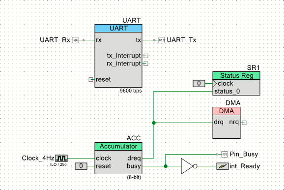

# 累算器の作成

データパスを使った簡単な例として、累算器を作成しました。
**FIFO**を**Input Mode**で使用しており、**DMA**にも対応しています。



## 累算器とは

累算(accumulation)は、入力された値を次々と足しこんでいく事を表した言葉です。
累算器(accumulator)は、入力された値の和を計算する装置を表しています。

入力として取り込む「足し込む値」は、データパスの**FIFO**で受け取ります。
データパスの**FIFO**に値を書き込むと累算動作が開始されます。

累算された結果は、データパスの**A0**レジスタに格納されます。
**FIFO**にデータをすべて書き込んだら**A0**レジスタから累算値を取り出します。

累算器には、二つの出力`dreq`と`busy`があります。
`dreq`は、**FIFO**に新たに値を書き込むことができる事(FIFO not full)を示します。
また、`busy`は、**FIFO**に書き込まれた値のすべての処理が終了していない事を示します。


## Verilog記述 (Accumulator8_v1_0.v)

累算器は、**Verilog**で記述されています。
中身は、3状態のステートマシンとデータパスから構成されています。

```verilog:Accumulator8_v1_0.v
module Accumulator8_v1_0 (
	output  dreq,
    output  busy,
	input   clock,
	input   reset
);

//`#start body` -- edit after this line, do not edit this line

// State code declaration
localparam      ST_IDLE = 2'b00;
localparam      ST_GET  = 2'b01;
localparam      ST_ADD  = 2'b11;

// Datapath function declaration
localparam      CS_IDLE = 3'b000;
localparam      CS_ADD  = 3'b001;

// Wire declaration
wire[1:0]       state;          // State code
wire            f0_empty;       // F0 is EMPTY
wire            f0_not_full;    // F0 is NOT FULL

// Pseudo register
reg[2:0]        addr;           // Datapath function
reg             d0_load;        // LOAD FIFO into D0
reg             busy_reg;       // BUSY output flag
```

最初の部分は、`localparam`, `wire`, `reg`の宣言です。
`ST_`で始まる`localparam`が状態コードを表しています。
また、`CS_`で始まる`localparam`はデータパスのConfiguration RAMに与えるアドレスを表しています。

```verilog:Accumulator8_v1_0.v
// State machine behavior
reg [1:0]       state_reg;
always @(posedge clock or posedge reset) begin
    if (reset) begin
        state_reg <= ST_IDLE;
    end else casez(state)
        ST_IDLE: begin      // Wait for FIFO not empty
            if (~f0_empty) begin
                state_reg <= ST_GET;
            end
        end
        ST_GET: begin       // Pull FIFO into D0
            state_reg <= ST_ADD;
        end
        ST_ADD: begin       // Add D0 into A0
            if (~f0_empty) begin
                state_reg <= ST_GET;
            end else begin
                state_reg <= ST_IDLE;
            end
        end
        default: begin      // Unidentified state
            state_reg <= ST_IDLE;
        end
    endcase
end
assign          state = state_reg;
```

ステートマシンの状態コードは2ビットです。
3状態が定義されていて、残りの1状態が未定義です。
ステートマシンは、以下のように動作します。

- `ST_IDLE`状態で**FIFO**にデータが到着するのを待ちます。
データが到着したら、`ST_GET`状態に遷移します。
- `ST_GET`状態では、**FIFO**から取り出したデータを**D0**レジスタに格納して、`ST_ADD`状態に遷移します。
- `ST_ADD`状態では、**A0**レジスタの値に**D0**レジスタの値を加算して、**A0**レジスタに書き戻します。
**FIFO**に次のデータが用意されていれば`ST_GET`状態に遷移し、**FIFO**が空であれば`ST_IDLE`状態に遷移します。

```verilog:Accumulator8_v1_0.v
// Internal control signals
always @(state) begin
    casez (state)
        ST_IDLE: begin
            addr = CS_IDLE;
            d0_load = 1'b0;
            busy_reg = 1'b0;
        end
        ST_GET: begin
            addr = CS_IDLE;
            d0_load = 1'b1;
            busy_reg = 1'b1;
        end
        ST_ADD: begin
            addr = CS_ADD;
            d0_load = 1'b0;
            busy_reg = 1'b1;
        end
        default: begin
            addr = CS_IDLE;
            d0_load = 1'b0;
            busy_reg = 1'b0;
        end
    endcase
end

// Data request output
assign      dreq = f0_not_full;

// BUSY status flag
assign      busy = busy_reg;
```

内部信号は、すべてステートマシンの状態で決定されます。

- `addr`信号でデータパスのConfiguration RAMアドレスを指定します。
- `d0_load`信号は、**FIFO**の値を`D0`レジスタに格納するタイミングを作っています。
- `busy_reg`信号は、累算器が動作している時にアサートされる信号で、そのまま`busy`出力信号となっています。
- `dreq`出力信号は、データパスが作成する"FIFO0 not FULL"信号をそのまま使用しています。

```verilog:Accumulator8_v1_0.v
cy_psoc3_dp8 #(.cy_dpconfig_a(
{
    `CS_ALU_OP_PASS, `CS_SRCA_A0, `CS_SRCB_D0,
    `CS_SHFT_OP_PASS, `CS_A0_SRC_NONE, `CS_A1_SRC_NONE,
    `CS_FEEDBACK_DSBL, `CS_CI_SEL_CFGA, `CS_SI_SEL_CFGA,
    `CS_CMP_SEL_CFGA, /*CFGRAM0: IDLE: Hold*/
    `CS_ALU_OP__ADD, `CS_SRCA_A0, `CS_SRCB_D0,
    `CS_SHFT_OP_PASS, `CS_A0_SRC__ALU, `CS_A1_SRC_NONE,
    `CS_FEEDBACK_DSBL, `CS_CI_SEL_CFGA, `CS_SI_SEL_CFGA,
    `CS_CMP_SEL_CFGA, /*CFGRAM1: ADD: A0 <= A0 + D0*/
    `CS_ALU_OP_PASS, `CS_SRCA_A0, `CS_SRCB_D0,
    `CS_SHFT_OP_PASS, `CS_A0_SRC_NONE, `CS_A1_SRC_NONE,
    `CS_FEEDBACK_DSBL, `CS_CI_SEL_CFGA, `CS_SI_SEL_CFGA,
    `CS_CMP_SEL_CFGA, /*CFGRAM2: */
    `CS_ALU_OP_PASS, `CS_SRCA_A0, `CS_SRCB_D0,
    `CS_SHFT_OP_PASS, `CS_A0_SRC_NONE, `CS_A1_SRC_NONE,
    `CS_FEEDBACK_DSBL, `CS_CI_SEL_CFGA, `CS_SI_SEL_CFGA,
    `CS_CMP_SEL_CFGA, /*CFGRAM3: */
    `CS_ALU_OP_PASS, `CS_SRCA_A0, `CS_SRCB_D0,
    `CS_SHFT_OP_PASS, `CS_A0_SRC_NONE, `CS_A1_SRC_NONE,
    `CS_FEEDBACK_DSBL, `CS_CI_SEL_CFGA, `CS_SI_SEL_CFGA,
    `CS_CMP_SEL_CFGA, /*CFGRAM4: */
    `CS_ALU_OP_PASS, `CS_SRCA_A0, `CS_SRCB_D0,
    `CS_SHFT_OP_PASS, `CS_A0_SRC_NONE, `CS_A1_SRC_NONE,
    `CS_FEEDBACK_DSBL, `CS_CI_SEL_CFGA, `CS_SI_SEL_CFGA,
    `CS_CMP_SEL_CFGA, /*CFGRAM5: */
    `CS_ALU_OP_PASS, `CS_SRCA_A0, `CS_SRCB_D0,
    `CS_SHFT_OP_PASS, `CS_A0_SRC_NONE, `CS_A1_SRC_NONE,
    `CS_FEEDBACK_DSBL, `CS_CI_SEL_CFGA, `CS_SI_SEL_CFGA,
    `CS_CMP_SEL_CFGA, /*CFGRAM6: */
    `CS_ALU_OP_PASS, `CS_SRCA_A0, `CS_SRCB_D0,
    `CS_SHFT_OP_PASS, `CS_A0_SRC_NONE, `CS_A1_SRC_NONE,
    `CS_FEEDBACK_DSBL, `CS_CI_SEL_CFGA, `CS_SI_SEL_CFGA,
    `CS_CMP_SEL_CFGA, /*CFGRAM7: */
    8'hFF, 8'h00,  /*CFG9: */
    8'hFF, 8'hFF,  /*CFG11-10: */
    `SC_CMPB_A1_D1, `SC_CMPA_A1_D1, `SC_CI_B_ARITH,
    `SC_CI_A_ARITH, `SC_C1_MASK_DSBL, `SC_C0_MASK_DSBL,
    `SC_A_MASK_DSBL, `SC_DEF_SI_0, `SC_SI_B_DEFSI,
    `SC_SI_A_DEFSI, /*CFG13-12: */
    `SC_A0_SRC_ACC, `SC_SHIFT_SL, 1'h0,
    1'h0, `SC_FIFO1_BUS, `SC_FIFO0_BUS,
    `SC_MSB_DSBL, `SC_MSB_BIT0, `SC_MSB_NOCHN,
    `SC_FB_NOCHN, `SC_CMP1_NOCHN,
    `SC_CMP0_NOCHN, /*CFG15-14: */
    10'h00, `SC_FIFO_CLK__DP,`SC_FIFO_CAP_AX,
    `SC_FIFO_LEVEL,`SC_FIFO__SYNC,`SC_EXTCRC_DSBL,
    `SC_WRK16CAT_DSBL /*CFG17-16: */
}
)) dp(
        /*  input                   */  .reset(reset),
        /*  input                   */  .clk(clock),
        /*  input   [02:00]         */  .cs_addr(addr),
        /*  input                   */  .route_si(1'b0),
        /*  input                   */  .route_ci(1'b0),
        /*  input                   */  .f0_load(1'b0),
        /*  input                   */  .f1_load(1'b0),
        /*  input                   */  .d0_load(d0_load),
        /*  input                   */  .d1_load(1'b0),
        /*  output                  */  .ce0(),
        /*  output                  */  .cl0(),
        /*  output                  */  .z0(),
        /*  output                  */  .ff0(),
        /*  output                  */  .ce1(),
        /*  output                  */  .cl1(),
        /*  output                  */  .z1(),
        /*  output                  */  .ff1(),
        /*  output                  */  .ov_msb(),
        /*  output                  */  .co_msb(),
        /*  output                  */  .cmsb(),
        /*  output                  */  .so(),
        /*  output                  */  .f0_bus_stat(f0_not_full),
        /*  output                  */  .f0_blk_stat(f0_empty),
        /*  output                  */  .f1_bus_stat(),
        /*  output                  */  .f1_blk_stat()
);

//`#end` -- edit above this line, do not edit this line
endmodule
```

最後にデータパスの宣言を行っています。
このコンポーネントでは、データパスを一つ使用しています。


## APIファイル

コンポーネントのAPIは、ヘッダファイルとソースファイルのそれぞれ一つずつで構成されています。ここでは、インスタンスのファイルを表示しています。

```c:ACC.h
#if !defined(ACCUMULATOR8_ACC_H)
#define ACCUMULATOR8_ACC_H

#include "cyfitter.h"
#include "cytypes.h"

//**************************************************************
//  Function Prototypes
//**************************************************************
void ACC_WriteValue(uint8 value);
uint8 ACC_ReadAccumulator(void);
void ACC_ClearAccumulator(void);

//**************************************************************
//  Registers
//**************************************************************
#define ACC_INPUT_REG (* (reg8 *) ACC_dp_u0__F0_REG)
#define ACC_INPUT_PTR (  (reg8 *) ACC_dp_u0__F0_REG)
#define ACC_ACCUMULATOR_REG (* (reg8 *) ACC_dp_u0__A0_REG)
#define ACC_ACCUMULATOR_PTR (  (reg8 *) ACC_dp_u0__A0_REG)

#endif  // ACCUMULATOR8_ACC_H
```

ヘッダファイルでは、三つのAPI関数とレジスタへのアドレスが宣言されています。関数については、後述します。

- ACC_INPUT_PTRは、**FIFO**の書き込みアドレスを指しています。
- ACC_ACCUMULATOR_PTRは、**A0**レジスタのアドレスを指しています。

```C:ACC.c
#include "ACC.h"

void ACC_WriteValue(uint8 value) {
    ACC_INPUT_REG = value;
}

uint8 ACC_ReadAccumulator(void) {
    return ACC_ACCUMULATOR_REG;
}

void ACC_ClearAccumulator(void) {
    ACC_ACCUMULATOR_REG = 0u;
}
```

ソースコードでは、三つの関数が定義されています。

- ACC_WriteValue()関数は、**FIFO**へ値を書き込みます。
- ACC_ReadAccumulator()関数は、累算された値を**A0**レジスタから読み出します。
- ACC_ClearAccumulator()関数は、**A0**レジスタの値をゼロにクリアします。

# DMA Capabilityファイル

**DMA Capability File**は、**DMA Wizard**でソースコードのひな型を生成する際に参照される情報を格納したファイルです。

```xml:Accumulator8_v1_0.cydmacap
<DMACapability>

  <Category name="" 
            enabled="true" 
            bytes_in_burst="1"
            bytes_in_burst_is_strict="true" 
            spoke_width="2" 
            inc_addr="false" 
            each_burst_req_request="true">
    <Location name="`$INSTANCE_NAME`_INPUT_PTR" enabled="true" direction="destination"/>
  </Category>
  
</DMACapability>
```

ヘッダファイルで宣言されたアドレスが、ここで使用されています。

## 累算器のテスト回路


累算器のテスト回路では、累算器に4Hzの遅いクロックを与えて**目で**動作を確認しています。**Pin_Busy**出力端子には、LEDが接続されていて、累算器の動作状態を見ることができます。ソフトウェアでは、**DMA**による書き込みとソフトウェアによる書き込みを行っています。

- DMAでの書込みでは、ソフトウェアでトリガをかけた後、**busy**信号の立下りにより割り込みが発生するまで待ちます。そして、累算器の値を読み出して**UART**に結果を出力しています。

```main.c
        // Clear the accumulator
        ACC_ClearAccumulator();

        // Trigger DMA
        CyDmaChEnable(DMA_Chan, 1);

        // Wait for calculation completed.
        while (!int_Ready_Flag) ;
        int_Ready_Flag = 0;
        
        // Get the calculation result
        result = ACC_ReadAccumulator();
        
        // Show the calculation result
        sprintf(sbuf, "ACC=%ld\r\n", result);
        UART_PutString(sbuf);
```

- ソフトウェアによる書き込みでは、**dreq**信号を**Status Register**によって監視しながら1バイトずつ書き込みを行います。こちらも割り込みが発生するまで待ち、累算器の値を読み出して**UART**に結果を出力しています。

```main.c
        // Clear the accumulator
        ACC_ClearAccumulator();
        
        // Add ten values into accumulator
        for (i = 0; i < DATA_SIZE; i++) {
            while (!(SR1_Read() & SR1_REQ)) ;
            ACC_WriteValue(inData[i]);
        }
        
        // Wait for calculation completed.
        while (!int_Ready_Flag) ;
        int_Ready_Flag = 0;
        
        // Get the calculation result
        result = ACC_ReadAccumulator();
        
        // Show the calculation result
        sprintf(sbuf, "ACC=%ld\r\n", result);
        UART_PutString(sbuf);
```
## 関連記事
[汎用レジスタの作成][PureRegister]

## リポジトリ
[GitHub Repository][repository]

[repository]:https://github.com/noritan/Design363
[PureRegister]:https://noritan-micon.blog.so-net.ne.jp/2019-07-08
