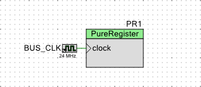
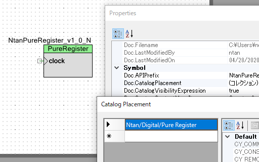
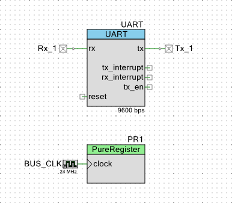

# 汎用レジスタの作成



「ペリフェラル領域に記憶域が欲しい」という要望を受けました。
レジスタが自由に使えるコンポーネントは無いかと探しましたが、面倒なので作ってしまいました。


## シンボル (NtanPureRegister_v1_0.cysym)



まずは、シンボルから。
シンボルには、クロック入力 clock だけを付けました。
データパスを使うときには、クロックは必須なんだそうです。

その他には、 Property の中で APIPrefix と CatalogPlacement を設定しました。
APIPrefix は、 API を作るときには有ったほうが良いよね。


## Verilogファイル (NtanPureRegister_v1_0.v)

シンボルから "Generate Verilog" で Verilog ファイルを作ります。
Datapath Config Tool を使って、 8-bit データパスを配置し、 clock だけ設定したら終了です。
データパスを配置したけれど、単なるレジスタファイルとして使うので、何も動かす必要はありません。

```Verilog:NtanPureRegister_v1_0.v

//`#start header` -- edit after this line, do not edit this line
// ========================================
//
// Copyright YOUR COMPANY, THE YEAR
// All Rights Reserved
// UNPUBLISHED, LICENSED SOFTWARE.
//
// CONFIDENTIAL AND PROPRIETARY INFORMATION
// WHICH IS THE PROPERTY OF your company.
//
// ========================================
`include "cypress.v"
//`#end` -- edit above this line, do not edit this line
// Generated on 07/08/2019 at 22:59
// Component: NtanPureRegister_v1_0
module NtanPureRegister_v1_0 (
	input   clock
);

//`#start body` -- edit after this line, do not edit this line

//        Your code goes here

cy_psoc3_dp #(.cy_dpconfig(
{
    `CS_ALU_OP_PASS, `CS_SRCA_A0, `CS_SRCB_D0,
    `CS_SHFT_OP_PASS, `CS_A0_SRC_NONE, `CS_A1_SRC_NONE,
    `CS_FEEDBACK_DSBL, `CS_CI_SEL_CFGA, `CS_SI_SEL_CFGA,
    `CS_CMP_SEL_CFGA, /*CFGRAM0: */
    `CS_ALU_OP_PASS, `CS_SRCA_A0, `CS_SRCB_D0,
    `CS_SHFT_OP_PASS, `CS_A0_SRC_NONE, `CS_A1_SRC_NONE,
    `CS_FEEDBACK_DSBL, `CS_CI_SEL_CFGA, `CS_SI_SEL_CFGA,
    `CS_CMP_SEL_CFGA, /*CFGRAM1: */
    `CS_ALU_OP_PASS, `CS_SRCA_A0, `CS_SRCB_D0,
    `CS_SHFT_OP_PASS, `CS_A0_SRC_NONE, `CS_A1_SRC_NONE,
    `CS_FEEDBACK_DSBL, `CS_CI_SEL_CFGA, `CS_SI_SEL_CFGA,
    `CS_CMP_SEL_CFGA, /*CFGRAM2: */
    `CS_ALU_OP_PASS, `CS_SRCA_A0, `CS_SRCB_D0,
    `CS_SHFT_OP_PASS, `CS_A0_SRC_NONE, `CS_A1_SRC_NONE,
    `CS_FEEDBACK_DSBL, `CS_CI_SEL_CFGA, `CS_SI_SEL_CFGA,
    `CS_CMP_SEL_CFGA, /*CFGRAM3: */
    `CS_ALU_OP_PASS, `CS_SRCA_A0, `CS_SRCB_D0,
    `CS_SHFT_OP_PASS, `CS_A0_SRC_NONE, `CS_A1_SRC_NONE,
    `CS_FEEDBACK_DSBL, `CS_CI_SEL_CFGA, `CS_SI_SEL_CFGA,
    `CS_CMP_SEL_CFGA, /*CFGRAM4: */
    `CS_ALU_OP_PASS, `CS_SRCA_A0, `CS_SRCB_D0,
    `CS_SHFT_OP_PASS, `CS_A0_SRC_NONE, `CS_A1_SRC_NONE,
    `CS_FEEDBACK_DSBL, `CS_CI_SEL_CFGA, `CS_SI_SEL_CFGA,
    `CS_CMP_SEL_CFGA, /*CFGRAM5: */
    `CS_ALU_OP_PASS, `CS_SRCA_A0, `CS_SRCB_D0,
    `CS_SHFT_OP_PASS, `CS_A0_SRC_NONE, `CS_A1_SRC_NONE,
    `CS_FEEDBACK_DSBL, `CS_CI_SEL_CFGA, `CS_SI_SEL_CFGA,
    `CS_CMP_SEL_CFGA, /*CFGRAM6: */
    `CS_ALU_OP_PASS, `CS_SRCA_A0, `CS_SRCB_D0,
    `CS_SHFT_OP_PASS, `CS_A0_SRC_NONE, `CS_A1_SRC_NONE,
    `CS_FEEDBACK_DSBL, `CS_CI_SEL_CFGA, `CS_SI_SEL_CFGA,
    `CS_CMP_SEL_CFGA, /*CFGRAM7: */
    8'hFF, 8'h00,  /*CFG9: */
    8'hFF, 8'hFF,  /*CFG11-10: */
    `SC_CMPB_A1_D1, `SC_CMPA_A1_D1, `SC_CI_B_ARITH,
    `SC_CI_A_ARITH, `SC_C1_MASK_DSBL, `SC_C0_MASK_DSBL,
    `SC_A_MASK_DSBL, `SC_DEF_SI_0, `SC_SI_B_DEFSI,
    `SC_SI_A_DEFSI, /*CFG13-12: */
    `SC_A0_SRC_ACC, `SC_SHIFT_SL, 1'h0,
    1'h0, `SC_FIFO1_BUS, `SC_FIFO0_BUS,
    `SC_MSB_DSBL, `SC_MSB_BIT0, `SC_MSB_NOCHN,
    `SC_FB_NOCHN, `SC_CMP1_NOCHN,
    `SC_CMP0_NOCHN, /*CFG15-14: */
    10'h00, `SC_FIFO_CLK__DP,`SC_FIFO_CAP_AX,
    `SC_FIFO_LEVEL,`SC_FIFO__SYNC,`SC_EXTCRC_DSBL,
    `SC_WRK16CAT_DSBL /*CFG17-16: */
}
)) dp(
        /*  input                   */  .reset(1'b0),
        /*  input                   */  .clk(clock),
        /*  input   [02:00]         */  .cs_addr(3'b0),
        /*  input                   */  .route_si(1'b0),
        /*  input                   */  .route_ci(1'b0),
        /*  input                   */  .f0_load(1'b0),
        /*  input                   */  .f1_load(1'b0),
        /*  input                   */  .d0_load(1'b0),
        /*  input                   */  .d1_load(1'b0),
        /*  output                  */  .ce0(),
        /*  output                  */  .cl0(),
        /*  output                  */  .z0(),
        /*  output                  */  .ff0(),
        /*  output                  */  .ce1(),
        /*  output                  */  .cl1(),
        /*  output                  */  .z1(),
        /*  output                  */  .ff1(),
        /*  output                  */  .ov_msb(),
        /*  output                  */  .co_msb(),
        /*  output                  */  .cmsb(),
        /*  output                  */  .so(),
        /*  output                  */  .f0_bus_stat(),
        /*  output                  */  .f0_blk_stat(),
        /*  output                  */  .f1_bus_stat(),
        /*  output                  */  .f1_blk_stat(),
        
        /* input                    */  .ci(1'b0),     // Carry in from previous stage
        /* output                   */  .co(),         // Carry out to next stage
        /* input                    */  .sir(1'b0),    // Shift in from right side
        /* output                   */  .sor(),        // Shift out to right side
        /* input                    */  .sil(1'b0),    // Shift in from left side
        /* output                   */  .sol(),        // Shift out to left side
        /* input                    */  .msbi(1'b0),   // MSB chain in
        /* output                   */  .msbo(),       // MSB chain out
        /* input [01:00]            */  .cei(2'b0),    // Compare equal in from prev stage
        /* output [01:00]           */  .ceo(),        // Compare equal out to next stage
        /* input [01:00]            */  .cli(2'b0),    // Compare less than in from prv stage
        /* output [01:00]           */  .clo(),        // Compare less than out to next stage
        /* input [01:00]            */  .zi(2'b0),     // Zero detect in from previous stage
        /* output [01:00]           */  .zo(),         // Zero detect out to next stage
        /* input [01:00]            */  .fi(2'b0),     // 0xFF detect in from previous stage
        /* output [01:00]           */  .fo(),         // 0xFF detect out to next stage
        /* input [01:00]            */  .capi(2'b0),   // Software capture from previous stage
        /* output [01:00]           */  .capo(),       // Software capture to next stage
        /* input                    */  .cfbi(1'b0),   // CRC Feedback in from previous stage
        /* output                   */  .cfbo(),       // CRC Feedback out to next stage
        /* input [07:00]            */  .pi(8'b0),     // Parallel data port
        /* output [07:00]           */  .po()          // Parallel data port
);
//`#end` -- edit above this line, do not edit this line
endmodule
//`#start footer` -- edit after this line, do not edit this line
//`#end` -- edit above this line, do not edit this line
```

コメントも何も書いてない。


## APIヘッダ (NtanPureRegister.h)

ヘッダファイルには、レジスタアドレスの読み替えマクロと、関数宣言が入っています。
ここでは、 A0 と A1 の二つのレジスタについての関数のみを定義しているので、 D0 と D1 が欲しい方は追加してください。

```C:NtanPureRegister.h
/* ========================================
 *
 * Copyright YOUR COMPANY, THE YEAR
 * All Rights Reserved
 * UNPUBLISHED, LICENSED SOFTWARE.
 *
 * CONFIDENTIAL AND PROPRIETARY INFORMATION
 * WHICH IS THE PROPERTY OF your company.
 *
 * ========================================
*/

#if !defined(`$INSTANCE_NAME`_H)
#define `$INSTANCE_NAME`_H
    
#include <cytypes.h>

#define `$INSTANCE_NAME`_A0_PTR ((reg8 *)`$INSTANCE_NAME`_dp__A0_REG)
#define `$INSTANCE_NAME`_A1_PTR ((reg8 *)`$INSTANCE_NAME`_dp__A1_REG)
#define `$INSTANCE_NAME`_D0_PTR ((reg8 *)`$INSTANCE_NAME`_dp__D0_REG)
#define `$INSTANCE_NAME`_D1_PTR ((reg8 *)`$INSTANCE_NAME`_dp__D1_REG)

extern uint8 `$INSTANCE_NAME`_ReadA0(void);
extern void `$INSTANCE_NAME`_WriteA0(uint8 value);
extern uint8 `$INSTANCE_NAME`_ReadA1(void);
extern void `$INSTANCE_NAME`_WriteA1(uint8 value);

#endif // `$INSTANCE_NAME`_H

/* [] END OF FILE */
```

## API本体 (NtanPureRegister.c)

API の本体は、関数定義を書いておしまいです。
何のことはない、 8-bit の値をデータパスのレジスタと読み書きするだけです。

```C:NtanPureRegister.c
/* ========================================
 *
 * Copyright YOUR COMPANY, THE YEAR
 * All Rights Reserved
 * UNPUBLISHED, LICENSED SOFTWARE.
 *
 * CONFIDENTIAL AND PROPRIETARY INFORMATION
 * WHICH IS THE PROPERTY OF your company.
 *
 * ========================================
*/
#include "`$INSTANCE_NAME`.h"

uint8 `$INSTANCE_NAME`_ReadA0(void) {
    return CY_GET_REG8(`$INSTANCE_NAME`_A0_PTR);
}
void `$INSTANCE_NAME`_WriteA0(uint8 value) {
    CY_SET_REG8(`$INSTANCE_NAME`_A0_PTR, value);
}

uint8 `$INSTANCE_NAME`_ReadA1(void) {
    return CY_GET_REG8(`$INSTANCE_NAME`_A1_PTR);
}
void `$INSTANCE_NAME`_WriteA1(uint8 value) {
    CY_SET_REG8(`$INSTANCE_NAME`_A1_PTR, value);
}

/* [] END OF FILE */
```

## DMA Capabilityファイル (NtanPureRegister_v1_0.cydmacap)

DMA Wizard は、このファイルを参照して DMA 制御プログラムの断片を作ります。
作りはしたけど、まだ使ってないから、誰か試してくださいな。

```XML:NtanPureRegister_v1_0.cydmacap
<?xml version="1.0" encoding="us-ascii"?>


<!--
      DMACapability needs to contain 1 or more Category tags. Category needs to contain 1 or more Location tags.
      
      Category Attributes
      ===================
  
        name:       The name of the cataegory to display to the user in the DMA Wizard. (If only one category is entered
                    it will not be displayed as a sub-category in the wizard. Instead it will just be used when the
                    user selects its associated instance.)
        
        enabled:    [OPTIONAL] "true" or "false". If not provided it defaults to true. If false, 
                    this category and its locations are not included in the DMA Wizard. Note: this value can be set 
                    to an expression referencing parameters by using `=` (e.g. `="Your Expression here"`).
        
        bytes_in_burst: Integer between 1 and 127. The number of bytes that can be sent/recieved in a single burst.
        
        bytes_in_burst_is_strict: "true" or "false". Determines whether the bytes_in_burst is a maximum value (false)
                                  or a specific value that must be used (true).
                            
        spoke_width:        Integer between 1 and 4. The spoke width in bytes. 
        
        inc_addr:           "true" or "false". Specifies whether or not the address is typically incremented.
     
        each_busrt_req_request: "true" or "false". Specifies whether or not a request is required for each burst.
     
      Location Attributes
      ===================
      
        name:      The name of the location to display to the user in the DMA Wizard.
       
        enabled:  [OPTIONAL] "true" or "false". If not provided it defaults to true. If false, this 
                  location is not included in the DMA Wizard. Note: this value can be set to an expression 
                  referencing parameters by using `=Your Expression here`.
       
        direction: "source", "destination", or "both".
  -->

<DMACapability>

  <Category name="" 
            enabled="true" 
            bytes_in_burst="1"
            bytes_in_burst_is_strict="true" 
            spoke_width="2" 
            inc_addr="false" 
            each_burst_req_request="true">
    <Location name="`$INSTANCE_NAME`_A0_PTR" enabled="true" direction="both"/>
    <Location name="`$INSTANCE_NAME`_A1_PTR" enabled="true" direction="both"/>
  </Category>
  
</DMACapability>
```

## 使い方 (PureRegisterTest01)



使い方は、簡単。
コンポーネントを回路図の上に置いて、クロックをつないだら、何も設定せずにすぐ使えます。

```C:main.c
/* ========================================
 *
 * Copyright YOUR COMPANY, THE YEAR
 * All Rights Reserved
 * UNPUBLISHED, LICENSED SOFTWARE.
 *
 * CONFIDENTIAL AND PROPRIETARY INFORMATION
 * WHICH IS THE PROPERTY OF your company.
 *
 * ========================================
*/
#include "project.h"
#include <stdio.h>

int main(void)
{
    uint8 i;
    char sbuf[128];
    
    CyGlobalIntEnable; /* Enable global interrupts. */

    /* Place your initialization/startup code here (e.g. MyInst_Start()) */
    UART_Start();
    UART_PutString("\r\nHELLO WORLD\r\n");
    sprintf(sbuf, "INIT A0=%d, A1=%d\r\n", PR1_ReadA0(), PR1_ReadA1());
    UART_PutString(sbuf);
    
    for (i = 0; i < 10; i++) {
        sprintf(sbuf, "WRITE A0=%d, A1=%d\r\n", i, 9-i);
        UART_PutString(sbuf);
        PR1_WriteA0(i);
        PR1_WriteA1(9-i);
        sprintf(sbuf, "READ A0=%d, A1=%d\r\n", PR1_ReadA0(), PR1_ReadA1());
        UART_PutString(sbuf);
    }    

    for(;;)
    {
        /* Place your application code here. */
    }
}

/* [] END OF FILE */
```

API 関数を使って、レジスタの読み書きができます。
DMA とも連携するはずです。

