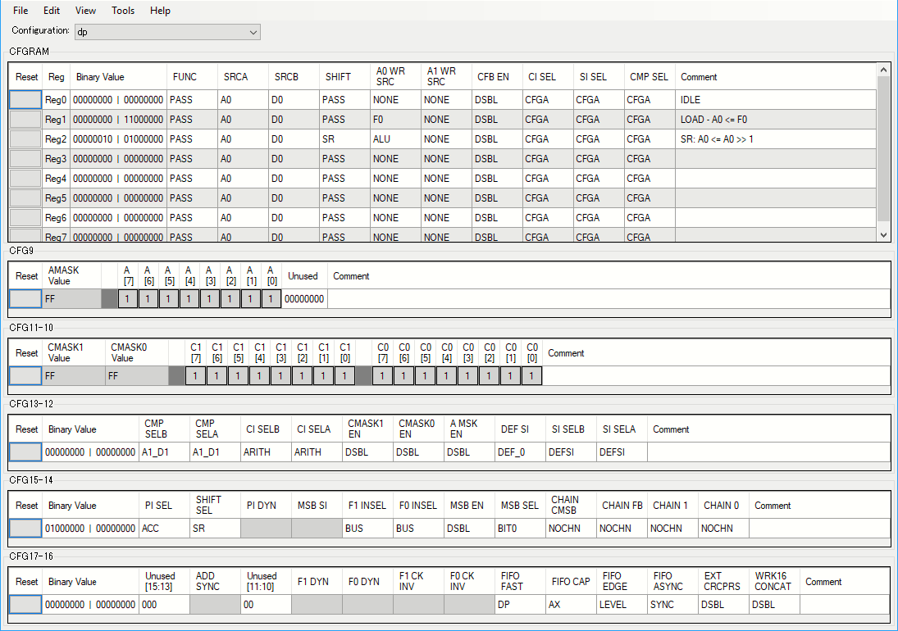

# UART Transmitter ReInovation on PSoC 5LP

It is required to generate a high speed **UART** signal to evaluate the **UART** receiver performance.
Because the transmitter performance is degraded when a software is used, a **UART** transmitter component controlled by hardware only is re-innovated.

## Symbol file (NtanUartTx_v1_0.cysym)


Because this component is assumed to be used as a jig, it is designed as simple as possible.

At first, the input signals `clock` and `reset` are mandatory because of a synchronous system.
The input signal `clock` is directly used as a bit clock.

The output signal `tx` is the **UART** signal output.
This component can be used as a transmitter when the `tx` signal is directly connected to an output pin.

The output signal `dreq` (Data Request) indicates that the component can accept a data to be sent.
This component converts a value written to a component's register into the **UART** signal output.
The register has a **FIFO** and the `dreq` signal means "FIFO is not full."

## Verilog file (NtanUartTx_v1_0.v)

The **Verilog** file describing the hardware consists of several parts as follows.

```Verilog:NtanUartTx_v1_0.v
module NtanUartTx_v1_0 (
	output  dreq,
	output  tx,
	input   clock,
	input   reset
);

//`#start body` -- edit after this line, do not edit this line

// State code declaration
localparam      ST_IDLE     = 4'b0000;
localparam      ST_START    = 4'b0100;
localparam      ST_SHIFT0   = 4'b1000;
localparam      ST_SHIFT1   = 4'b1001;
localparam      ST_SHIFT2   = 4'b1010;
localparam      ST_SHIFT3   = 4'b1011;
localparam      ST_SHIFT4   = 4'b1100;
localparam      ST_SHIFT5   = 4'b1101;
localparam      ST_SHIFT6   = 4'b1110;
localparam      ST_SHIFT7   = 4'b1111;
localparam      ST_STOP     = 4'b0001;

// Datapath function
localparam      CS_IDLE     = 3'b000;
localparam      CS_LOAD     = 3'b001;
localparam      CS_SR       = 3'b010;
```

There is a `module` declaration followed by `localparam` declarations.

There is one statemachine in this component.
The `localparam` labels begining with `ST_` indicate the 4-bit state codes for the statemachine.
When a **UART** is designed, it is useful to have a bit counter other than the statemachine.
In this component, the behaviro is expressed by the state transition only.

This component uses one datapath block.
A datapath can have up to eight functions, and an external block can specify which function is to be used.
In this component three out of eight functions are configured.
The labels begining with `CS_` indicate the function's code.

```Verilog:NtanUartTx_v1_0.v
// Wire declaration
wire[3:0]       state;          // State code
wire            f0_empty;       // F0 is EMPTY
wire            f0_not_full;    // F0 is not FULL
wire            so;             // Shift out

// Pseudo register
reg[2:0]        addr;           // MSB part of Datapath function

// Output signal buffer
reg             tx_reg;         // DFF for output
```

`wire` and `reg` are declared which are used internally.

There are declarations of `state` signal indicating the state code, `f0_empty` and `f0_not_full` signals indicating the state of the **FIFO**, and `so` signal indicating the shift output from the datapath.

The register `addr` is a pseudo register indicating the function of the datapath.

The `tx` output has a dedicated **DFF** (`tx_reg`) to get a glitch-free output signal which is completely sychronized to the clock.

```Verilog:NtanUartTx_v1_0.v
// State machine behavior
reg [3:0]       state_reg;
always @(posedge reset or posedge clock) begin
    if (reset) begin
                state_reg <= ST_IDLE;
    end else casez (state)
        ST_IDLE:
            if (~f0_empty) begin
                state_reg <= ST_START;
            end
        ST_START:
                state_reg <= ST_SHIFT0;
        ST_SHIFT0:
                state_reg <= ST_SHIFT1;
        ST_SHIFT1:
                state_reg <= ST_SHIFT2;
        ST_SHIFT2:
                state_reg <= ST_SHIFT3;
        ST_SHIFT3:
                state_reg <= ST_SHIFT4;
        ST_SHIFT4:
                state_reg <= ST_SHIFT5;
        ST_SHIFT5:
                state_reg <= ST_SHIFT6;
        ST_SHIFT6:
                state_reg <= ST_SHIFT7;
        ST_SHIFT7:
                state_reg <= ST_STOP;
        ST_STOP:
            if (~f0_empty) begin
                state_reg <= ST_START;
            end else begin
                state_reg <= ST_IDLE;
            end
        default:
                state_reg <= ST_IDLE;
    endcase
end
assign      state = state_reg;
```

There are state transtions only in the statemachine.
When a data arrives at the **FIFO** (Not `f0_empty`) a **UART** signal generation sequence starts.
Each state is corresponding to one bit clock.
There are too much description but simple.

After the last STOP bit is sent in the `ST_STOP` state, the statemachine makes a transition to the `ST_START` when the next data is already arrived at the **FIFO** to send consecutive characters with no gap between them.

```Verilog:NtanUartTx_v1_0.v
// Internal control signals
always @(state) begin
    casez (state)
        ST_IDLE: begin
            addr    = CS_IDLE;
        end
        ST_START: begin
            addr    = CS_LOAD;
        end
        ST_SHIFT0, ST_SHIFT1, ST_SHIFT2, ST_SHIFT3,
        ST_SHIFT4, ST_SHIFT5, ST_SHIFT6, ST_SHIFT7: begin
            addr    = CS_SR;
        end
        ST_STOP: begin
            addr    = CS_IDLE;
        end
        default: begin
            addr    = CS_IDLE;
        end
    endcase
end
```

Internal signals are specified by the state of the statemachine.

There is one internal signal `addr` to specify the function of the datapath.
In the `ST_START` state, the `CS_LOAD` function is activated to pull a data byte from the **FIFO** into the `A0` register.
In the eight state from `ST_SHIFT0` to `ST_SHIFT7`, the data stored in the `A0` register is shifted and used as the transmitter output

```Verilog:NtanUartTx_v1_0.v
// TX output behavior
// Implemented in negative logic
always @(posedge reset or posedge clock) begin
    if (reset) begin
            tx_reg <= 1'b0;  // MARK
    end else casez (state)
        ST_IDLE:
            tx_reg <= 1'b0;  // MARK
        ST_START:
            tx_reg <= 1'b1;  // SPACE
        ST_SHIFT0, ST_SHIFT1, ST_SHIFT2, ST_SHIFT3,
        ST_SHIFT4, ST_SHIFT5, ST_SHIFT6, ST_SHIFT7:
            tx_reg <= ~so;
        ST_STOP:
            tx_reg <= 1'b0;  // MARK
        default:
            tx_reg <= 1'b0;  // MARK
    endcase
end
assign tx = ~tx_reg;

// DREQ output behavior
assign dreq = f0_not_full;
```

The behavior of two output signals `tx` and `dreq` are specified here.

As described above, the `tx` output signal is synchronized to the clock using the `tx_reg` register.
When the `tx` output is directly used as the input of the `tx_reg` register, the `tx_reg` output becomes `1` out of resets.
On the other hand, the initial output of the **DFF** in the **PSoC**'s **UDB** block is `0`, a rising edge will be generated at the `tx` output.
To resolve this problem easily, the `tx_eg` register logic is changed to a negative one.
In concrete terms, the reset state of the `tx_reg` register is set to `0`.
No rising edge is observed at the `tx` output at the reset.

The `f0_not_full` signal to indicate the **FIFO** status is directly used for the `dreq` output.

```Verilog:NtanUartTx_v1_0.v
cy_psoc3_dp #(.cy_dpconfig(
{
    `CS_ALU_OP_PASS, `CS_SRCA_A0, `CS_SRCB_D0,
    `CS_SHFT_OP_PASS, `CS_A0_SRC_NONE, `CS_A1_SRC_NONE,
    `CS_FEEDBACK_DSBL, `CS_CI_SEL_CFGA, `CS_SI_SEL_CFGA,
    `CS_CMP_SEL_CFGA, /*CFGRAM0: IDLE*/
    `CS_ALU_OP_PASS, `CS_SRCA_A0, `CS_SRCB_D0,
    `CS_SHFT_OP_PASS, `CS_A0_SRC___F0, `CS_A1_SRC_NONE,
    `CS_FEEDBACK_DSBL, `CS_CI_SEL_CFGA, `CS_SI_SEL_CFGA,
    `CS_CMP_SEL_CFGA, /*CFGRAM1: LOAD - A0 <= F0*/
    `CS_ALU_OP_PASS, `CS_SRCA_A0, `CS_SRCB_D0,
    `CS_SHFT_OP___SR, `CS_A0_SRC__ALU, `CS_A1_SRC_NONE,
    `CS_FEEDBACK_DSBL, `CS_CI_SEL_CFGA, `CS_SI_SEL_CFGA,
    `CS_CMP_SEL_CFGA, /*CFGRAM2: SR: A0 <= A0 >> 1*/
    `CS_ALU_OP_PASS, `CS_SRCA_A0, `CS_SRCB_D0,
    `CS_SHFT_OP_PASS, `CS_A0_SRC_NONE, `CS_A1_SRC_NONE,
    `CS_FEEDBACK_DSBL, `CS_CI_SEL_CFGA, `CS_SI_SEL_CFGA,
    `CS_CMP_SEL_CFGA, /*CFGRAM3:  */
    `CS_ALU_OP_PASS, `CS_SRCA_A0, `CS_SRCB_D0,
    `CS_SHFT_OP_PASS, `CS_A0_SRC_NONE, `CS_A1_SRC_NONE,
    `CS_FEEDBACK_DSBL, `CS_CI_SEL_CFGA, `CS_SI_SEL_CFGA,
    `CS_CMP_SEL_CFGA, /*CFGRAM4:  */
    `CS_ALU_OP_PASS, `CS_SRCA_A0, `CS_SRCB_D0,
    `CS_SHFT_OP_PASS, `CS_A0_SRC_NONE, `CS_A1_SRC_NONE,
    `CS_FEEDBACK_DSBL, `CS_CI_SEL_CFGA, `CS_SI_SEL_CFGA,
    `CS_CMP_SEL_CFGA, /*CFGRAM5:  */
    `CS_ALU_OP_PASS, `CS_SRCA_A0, `CS_SRCB_D0,
    `CS_SHFT_OP_PASS, `CS_A0_SRC_NONE, `CS_A1_SRC_NONE,
    `CS_FEEDBACK_DSBL, `CS_CI_SEL_CFGA, `CS_SI_SEL_CFGA,
    `CS_CMP_SEL_CFGA, /*CFGRAM6:  */
    `CS_ALU_OP_PASS, `CS_SRCA_A0, `CS_SRCB_D0,
    `CS_SHFT_OP_PASS, `CS_A0_SRC_NONE, `CS_A1_SRC_NONE,
    `CS_FEEDBACK_DSBL, `CS_CI_SEL_CFGA, `CS_SI_SEL_CFGA,
    `CS_CMP_SEL_CFGA, /*CFGRAM7:  */
    8'hFF, 8'h00,  /*CFG9:  */
    8'hFF, 8'hFF,  /*CFG11-10:  */
    `SC_CMPB_A1_D1, `SC_CMPA_A1_D1, `SC_CI_B_ARITH,
    `SC_CI_A_ARITH, `SC_C1_MASK_DSBL, `SC_C0_MASK_DSBL,
    `SC_A_MASK_DSBL, `SC_DEF_SI_0, `SC_SI_B_DEFSI,
    `SC_SI_A_DEFSI, /*CFG13-12:  */
    `SC_A0_SRC_ACC, `SC_SHIFT_SR, 1'h0,
    1'h0, `SC_FIFO1_BUS, `SC_FIFO0_BUS,
    `SC_MSB_DSBL, `SC_MSB_BIT0, `SC_MSB_NOCHN,
    `SC_FB_NOCHN, `SC_CMP1_NOCHN,
    `SC_CMP0_NOCHN, /*CFG15-14:  */
    10'h00, `SC_FIFO_CLK__DP,`SC_FIFO_CAP_AX,
    `SC_FIFO_LEVEL,`SC_FIFO__SYNC,`SC_EXTCRC_DSBL,
    `SC_WRK16CAT_DSBL /*CFG17-16:  */
}
)) dp(
        /*  input                   */  .reset(reset),
        /*  input                   */  .clk(clock),
        /*  input   [02:00]         */  .cs_addr(addr[2:0]),
        /*  input                   */  .route_si(1'b0),
        /*  input                   */  .route_ci(1'b0),
        /*  input                   */  .f0_load(1'b0),
        /*  input                   */  .f1_load(1'b0),
        /*  input                   */  .d0_load(1'b0),
        /*  input                   */  .d1_load(1'b0),
        /*  output                  */  .ce0(),
        /*  output                  */  .cl0(),
        /*  output                  */  .z0(),
        /*  output                  */  .ff0(),
        /*  output                  */  .ce1(),
        /*  output                  */  .cl1(),
        /*  output                  */  .z1(),
        /*  output                  */  .ff1(),
        /*  output                  */  .ov_msb(),
        /*  output                  */  .co_msb(),
        /*  output                  */  .cmsb(),
        /*  output                  */  .so(so),
        /*  output                  */  .f0_bus_stat(f0_not_full),
        /*  output                  */  .f0_blk_stat(f0_empty),
        /*  output                  */  .f1_bus_stat(),
        /*  output                  */  .f1_blk_stat(),
        
        /* input                    */  .ci(1'b0),     // Carry in from previous stage
        /* output                   */  .co(),         // Carry out to next stage
        /* input                    */  .sir(1'b0),    // Shift in from right side
        /* output                   */  .sor(),        // Shift out to right side
        /* input                    */  .sil(1'b0),    // Shift in from left side
        /* output                   */  .sol(),        // Shift out to left side
        /* input                    */  .msbi(1'b0),   // MSB chain in
        /* output                   */  .msbo(),       // MSB chain out
        /* input [01:00]            */  .cei(2'b0),    // Compare equal in from prev stage
        /* output [01:00]           */  .ceo(),        // Compare equal out to next stage
        /* input [01:00]            */  .cli(2'b0),    // Compare less than in from prv stage
        /* output [01:00]           */  .clo(),        // Compare less than out to next stage
        /* input [01:00]            */  .zi(2'b0),     // Zero detect in from previous stage
        /* output [01:00]           */  .zo(),         // Zero detect out to next stage
        /* input [01:00]            */  .fi(2'b0),     // 0xFF detect in from previous stage
        /* output [01:00]           */  .fo(),         // 0xFF detect out to next stage
        /* input [01:00]            */  .capi(2'b0),   // Software capture from previous stage
        /* output [01:00]           */  .capo(),       // Software capture to next stage
        /* input                    */  .cfbi(1'b0),   // CRC Feedback in from previous stage
        /* output                   */  .cfbo(),       // CRC Feedback out to next stage
        /* input [07:00]            */  .pi(8'b0),     // Parallel data port
        /* output [07:00]           */  .po()          // Parallel data port
);
//`#end` -- edit above this line, do not edit this line
endmodule
```

The last part is the datapath.
Folowing intput/output signals are connected.

|Terminal name|Signal name|Remarks|
|:--|:--|:--|
|.reset|reset|Reset signal|
|.clk|clock|Clock signal|
|.cs_addr|addr[2:0]|Function code|
|.so|so|Shift output|
|.f0_bus_stat|f0_not_full|The status of the **FIFO** from the point of view of the bus.|
|.f0_blk_stat|f0_empty|The status of the **FIFO** from the point of view of the datapath|

The `Datapath Configuration Tool` is used to configure the datapath behavior.




## API header file (UartTx.h)

This component's API is described in a header file and a source file.
In this document, API files extracted as an instance are shown.

```C:UartTx.h
#if !defined(NTANUARTTX_UartTx_H)
#define NTANUARTTX_UartTx_H
    
#include <cytypes.h>

#define UartTx_INPUT_REG (* (reg8 *)UartTx_dp__F0_REG)
#define UartTx_INPUT_PTR (  (reg8 *)UartTx_dp__F0_REG)

extern void UartTx_WriteValue(uint8 value);

#endif // NTANUARTTX_UartTx_H
```

In the first half of the header file "UartTx.h" there are MACRO declarations of the register where the transmit data is written and the register's address.
These MACROs are used in the API source file and the **DMA** configuration.

In the second half, there is a declaration of the `UartTx_WriteValue()` function to write a transmit data.
The definition of the function is described in the source file.

## API source file (UartTx.c)

```C:UartTx.c
#include "UartTx.h"

void UartTx_WriteValue(uint8 value) {
    UartTx_INPUT_REG = value;
}
```

In the API source file, there is an API function definition only.
This function writes a data `value` given as an argument into the register.

## DMA Capability file (NtanUartTx_v1_0.cydmacap)

The "DMA Wizard" program refers this file to create a code snipet for the DMA control program.

```xml:NtanUartTx_v1_0.cydmacap
<DMACapability>

  <Category name="" 
            enabled="true" 
            bytes_in_burst="1"
            bytes_in_burst_is_strict="true" 
            spoke_width="2" 
            inc_addr="false" 
            each_burst_req_request="true">
    <Location name="`$INSTANCE_NAME`_INPUT_PTR" enabled="true" direction="destination"/>
  </Category>
  
</DMACapability>
```

The register address MACRO declared in the API header file is used here.


## Test Project (1) - UartTxTest01

A test project is created to test the component.
The first project writes data directly using a software.


### Schematic
")

Because this component is designed to output a signal, an equipment like an oscilloscope must be prepared to observe the output signal.
But, don't worry.
By the **PSoC 5LP**'s powerful hardware, a **Logic Analyzer** is implemented in the test project.

Because the output signal is observed by the internal **Logic Analyzer**, the **UART**'s baud rate speed is set to 20bps.

### Program (main.c)

Following is the program in "main.c" file.

```C:main.c
#include "project.h"

// SR1 status register bit assignment
#define SR1_DREQ (1)
#define SR1_SW1  (2)
```

This project works by refering the **Status Register** `SR1` to get the status of the switch `SW1` and the `dreq` signal.
There are MACRO declarations to specify the bit position of two inputs of `SR1`.

```C:main.c
// Statemachine declaration
#define ST_IDLE (0)
#define ST_SEND (1)
#define ST_WAIT (2)

uint32 state = ST_IDLE;
```

There is a statemachine to control the write sequence to the component.
The statemachine has three states and uses the state variable `state`.

```C:main.c
// Data packet to be sent
const char phrase[] = "The quick brown fox jumps over the lazy dog. ";
uint8 packet[8];
```

In this test project, any data can be sent as **UART** output.
To make an "any data" a program is created to fill a specific phrase into a fixed size of packet to support any size of packet.

```C:main.c
// Interrupt handling
volatile CYBIT int_Sample_flag = 0;

CY_ISR(int_Sample_isr) {
    int_Sample_flag = 1;
}
```

An Interrupt Service Routine (ISR) is defined to be invoked by a periodic interrupt.
The periodic interrpt is used by the **Logic Analyzer**.
There is a flag used by the periodic interrupt together.
This flag is referred in the main loop.

```C:main.c
// The main-loop
int main(void)
{
    uint32 index = 0;
    
    CyGlobalIntEnable; /* Enable global interrupts. */

    // Initialize the logic analyzer task
    Probe_UART_Start();
    int_Sample_StartEx(int_Sample_isr);
```

At first in the `main()` function, two components `Probe_UART` and `int_Sample` used in the **Logic Analyzer** are initialized.

```C:main.c
    // Initialize the statemachine task
    state = ST_IDLE;

    // Initialize the packet[]
    // Copy the phrase[] into packet[] as possible
    for (uint32 k = 0; k < sizeof packet; ) {
        for (uint32 i = 0; i < sizeof phrase; i++) {
            packet[k++] = phrase[i];
            if (k >= sizeof packet) break;
        }
    }
```

After the statemachin initialization, a packet is created to be used as a transmitter data.

```C:main.c
    for(;;)
    {
        // Statemachine dispatcher
        switch (state) {
            case ST_IDLE:
                // Wait for the SW1 pushed
                if (!(SR1_Read() & SR1_SW1)) {
                    // SW1 pushed
                    index = 0;
                    state = ST_SEND;
                }
                break;
            case ST_SEND:
                // Send a packet until exhausted
                if ((SR1_Read() & SR1_DREQ)) {
                    UartTx_WriteValue(packet[index++]);
                }
                if (index >= sizeof packet) {
                    state = ST_WAIT;
                }
                break;
            case ST_WAIT:
                // Wait for the SW1 released
                if (SR1_Read() & SR1_SW1) {
                    state = ST_IDLE;
                }
                break;
            default:
                state = ST_IDLE;
        }
```

There are two **dispatcher** in the main loop.
The first one is the statemachine's **dispatcher**.

In the `ST_IDLE` state, the push event of the `SW1` button is detected.
When the `SW1` button is pushed, the statemachine makes a transition to the `ST_SEND` state.

In the `ST_SEND` state, a byte of data packet is sent.
When the `dreq` is asserted (`UartTx` can accept a data) a byte of data is sent using the `UartTx_WriteValue()` function.
The statemachine makes a transition to the `ST_WAIT` state after writing a byte.

In the `ST_WAIT` state, the release event of the `SW1` button is detected and the state machine makes a transition to the `ST_IDLE` state.
If you need a **debounce** feature, please add a **Debounce** component between the `Pin_SW1` input pin and the `SR1` status register.

```C:main.c
        // Logic analyzer dispatcher
        if (int_Sample_flag) {
            int_Sample_flag = 0;
            Probe_UART_PutChar(Probe_Read());
        }
    }
}
```

There is a **Logic Analyzer** process in the second **dispatcher**.
It is very simple that sending a value of the `Probe` component using the `Probe_UART` component.

### Execution Result

The execution result is observed by the **Bridge Control Panel**.
Waveforms are "SW1" "DREQ" and "TX" beginning at the top.

")

It was found that eight bytes of data are sent without additional gaps.
It was also found from the "DREQ" behavior that all data are written to the **FIFO** when the transmitting of the 4th byte is started.


## Test Project (2) - UartTxTest02

The second project uses a **DMA** to send the data packet.

### Schematic

")

A **DMA** component is added to the test poject (1).
The **DMA**'s `drq` input is configured as a "Level" input.


### Program (main.c)

The program was chamged a little from one of the test project (1).

```C:main.c
// Defines for DMA_UartTx
#define DMA_UartTx_BYTES_PER_BURST 1
#define DMA_UartTx_REQUEST_PER_BURST 1
#define DMA_UartTx_SRC_BASE (CYDEV_SRAM_BASE)
#define DMA_UartTx_DST_BASE (CYDEV_PERIPH_BASE)

// Variable declarations for DMA_UartTx
// Move these variable declarations to the top of the function
uint8 DMA_UartTx_Chan;
uint8 DMA_UartTx_TD[1];
```

Some **DMA** specific declarations are added to the constant and variable declarations.
These are copied from the code snipet generated by the **DMA Wizard** utility.

```C:main.c
    // DMA Configuration for DMA_UartTx
    DMA_UartTx_Chan = DMA_UartTx_DmaInitialize(
        DMA_UartTx_BYTES_PER_BURST, DMA_UartTx_REQUEST_PER_BURST, 
        HI16(DMA_UartTx_SRC_BASE), HI16(DMA_UartTx_DST_BASE));
    DMA_UartTx_TD[0] = CyDmaTdAllocate();
    CyDmaTdSetConfiguration(DMA_UartTx_TD[0], sizeof packet, CY_DMA_DISABLE_TD, CY_DMA_TD_INC_SRC_ADR);
    CyDmaTdSetAddress(DMA_UartTx_TD[0], LO16((uint32)packet), LO16((uint32)UartTx_INPUT_PTR));
    CyDmaChSetInitialTd(DMA_UartTx_Chan, DMA_UartTx_TD[0]);
```

**DMA** initialization is added to the initialization part of the `main()` function.
These are copied from the **DMA Wizard**'s code snipet except the function call of `CyDmaChEnable()` which is invoked later.

```C:main.c
        // Statemachine dispatcher
        switch (state) {
            case ST_IDLE:
                // Wait for the SW1 pushed
                if (!(SR1_Read() & SR1_SW1)) {
                    // SW1 pushed
                    CyDmaChEnable(DMA_UartTx_Chan, 1);
                    state = ST_SEND;
                }
                break;
            case ST_SEND:
                // Send a packet until exhausted
                {
                    uint8 dmaState;
                    CyDmaChStatus(DMA_UartTx_Chan, NULL, &dmaState);
                    if (!(dmaState & CY_DMA_STATUS_CHAIN_ACTIVE)) {
                        state = ST_WAIT;
                    }
                }
                break;
            case ST_WAIT:
                // Wait for the SW1 released
                if (SR1_Read() & SR1_SW1) {
                    state = ST_IDLE;
                }
                break;
            default:
                state = ST_IDLE;
        }
```

The statemachine's **dispatcher** was changed in some points.

When the `SW1`'s push event is detected in the `ST_IDLE` state, the statemachine just makes a transition in the test project (1).
In this project, `CyDmaChEnable()` function is invoked to start the **DMA** in addition to the state transition.
Once **DMA** starts a transfer, The data transfer is automatically executed.

In the `ST_SEND` state, there are nothing to do because the **DMA** automatically prepares data to be sent.
It is required to detect the **DMA** transfer is completed and make a transition to the `ST_WAIT` state.
The `CyDmaChStatus()` function is used to get the status of the **DMA**.
The status detected by the function is the timing of all data are written to the **FIFO**.
It is not a timing of all data are sent by **UART**.
Therefore more data may be sent from **UART** when the `SW1` is pushed during the **UART** transmission is in progress.


### Execution Result

The execution resuilt is same as one of the test project (1) because the **DMA** is used instead of the software.
The waveform is omitted.


## Test Project (3)) - UartTxTest03

It seems that the output waveform observed by the **Logic Analyzer** is well.
As the next step, the **UART** signal is provided to the **USBUART** on the **KitProg** to observe in PC.

### Schematic

")

The **Logic Analyzer** part is removed and the `UartTx`'s output is connected to the `Tx_1` output pin.
Now you can observe the **UART** signal on your **PC** using the **USBUART**.

The baud rate is configured as 115200bps because this is the highest baud rate supported by the **USBUART**.

### Program (main.c)

In this project, the packet size is expanded to 256 bytes to observe the output on a terminal application like "Tera Term"

```C:main.c
// Data packet to be sent
const char phrase[] = "The quick brown fox jumps over the lazy dog. ";
uint8 packet[256];
```

Because the status register `SR1` is also remove, the `SW1` status is directly read from the input pin component `Pin_SW1`.

```C:main.c
        // Statemachine dispatcher
        switch (state) {
            case ST_IDLE:
                // Wait for the SW1 pushed
                if (!Pin_SW1_Read()) {
                    // SW1 pushed
                    CyDmaChEnable(DMA_UartTx_Chan, 1);
                    state = ST_SEND;
                }
                break;
            case ST_SEND:
                // Send a packet until exhausted
                {
                    uint8 dmaState;
                    CyDmaChStatus(DMA_UartTx_Chan, NULL, &dmaState);
                    if (!(dmaState & CY_DMA_STATUS_CHAIN_ACTIVE)) {
                        state = ST_WAIT;
                    }
                }
                break;
            case ST_WAIT:
                // Wait for the SW1 released
                if (Pin_SW1_Read()) {
                    state = ST_IDLE;
                }
                break;
            default:
                state = ST_IDLE;
        }
```

### execution result

")

When the `SW1` button is pushed, 256 characters data are sent to the terminal application.


## Related Articles
* [Logic Analyzer using UART on CY8CKIT-042][]
* [Multiplier Supporting DMA on PSoC 3][]


[Logic Analyzer using UART on CY8CKIT-042]:https://noritan-micon.blog.so-net.ne.jp/2015-10-11-1
[Multiplier Supporting DMA on PSoC 3]:https://noritan-micon.blog.so-net.ne.jp/2013-06-09
