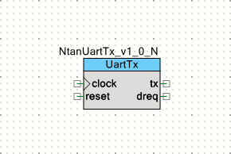
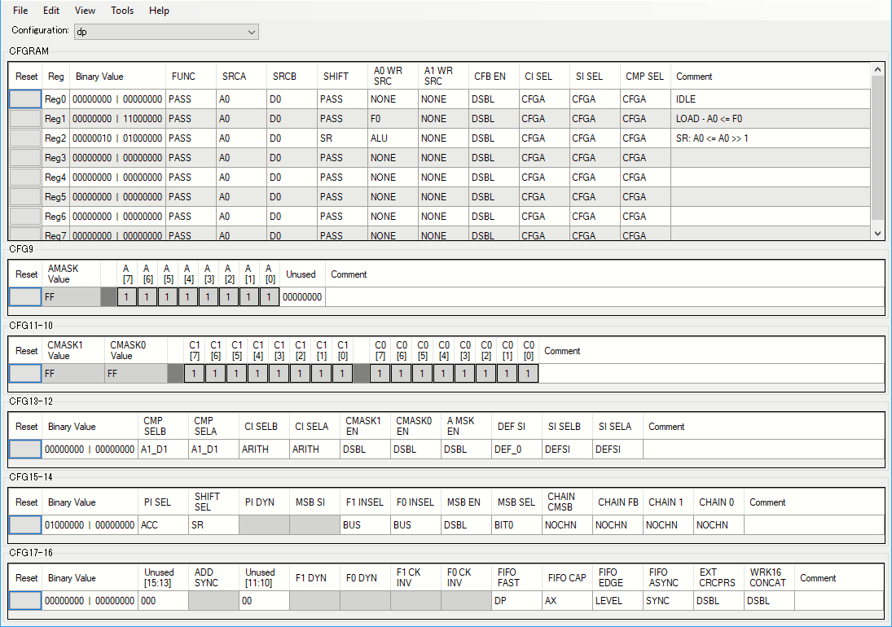

# PSoC 5LPでUART送信機を再発明した

**UART**の受信性能を調べるために**UART**の信号を高速に生成する必要が生じました。
ソフトウェアが介在すると遅くなっちゃうので、ハードウェアだけで完結する**UART**送信機コンポーネントを再発明することにしました。

## シンボル



今回作成するコンポーネントは、あくまでも治具としての用途を考えているため、可能な限りシンプルな構成にしました。

まず、同期回路で構成しているので、`clock`と`reset`は必須です。
このコンポーネントでは、`clock`で与えられた信号そのものをビットクロックとして使用します。

`tx`出力は、**UART**の信号出力です。
この信号を直接出力端子に接続すると、送信機として使えます。

`dreq` (Data Request)は、このコンポーネントがデータを受け入れ可能であることを示す信号です。
このコンポーネントは、このコンポーネントが持つレジスタに書き込まれた値を**UART**信号に変換して出力します。
レジスタには**FIFO**を装備しますが、**FIFO**がいっぱいになっていない事を`dreq`出力で示しています。

## Verilog記述

ハードウェアを表現するための**Verilog**記述は、いくつかの部分から構成されています。

```Verilog:NtanUartTx_v1_0.v
module NtanUartTx_v1_0 (
	output  dreq,
	output  tx,
	input   clock,
	input   reset
);

//`#start body` -- edit after this line, do not edit this line

// State code declaration
localparam      ST_IDLE     = 4'b0000;
localparam      ST_START    = 4'b0100;
localparam      ST_SHIFT0   = 4'b1000;
localparam      ST_SHIFT1   = 4'b1001;
localparam      ST_SHIFT2   = 4'b1010;
localparam      ST_SHIFT3   = 4'b1011;
localparam      ST_SHIFT4   = 4'b1100;
localparam      ST_SHIFT5   = 4'b1101;
localparam      ST_SHIFT6   = 4'b1110;
localparam      ST_SHIFT7   = 4'b1111;
localparam      ST_STOP     = 4'b0001;

// Datapath function
localparam      CS_IDLE     = 3'b000;
localparam      CS_LOAD     = 3'b001;
localparam      CS_SR       = 3'b010;
```

`module`宣言のあと、定数の定義が続きます。

このコンポーネントには、ステートマシンが一つあります。
4ビットの状態コードは、プリフィックスとして`ST_`を付けています。
**UART**を普通に作ろうとすると、ビットカウンタを外につけたくなるのですが、このコンポーネントでは、ベタに状態遷移だけで表現する方法をとっています。

このコンポーネントでは、データパスをひとつ使用しています。
データパスには、最大8種類の動作を設定する事ができ、外部からどの動作を行わせるかを決定することができます。
このコンポーネントでは、8個のうち3個の設定だけを使っています。
プリフィックスとして`CS_`を付けた定数でそれぞれの設定を示しています。

```Verilog:NtanUartTx_v1_0.v
// Wire declaration
wire[3:0]       state;          // State code
wire            f0_empty;       // F0 is EMPTY
wire            f0_not_full;    // F0 is not FULL
wire            so;             // Shift out

// Pseudo register
reg[2:0]        addr;           // MSB part of Datapath function

// Output signal buffer
reg             tx_reg;         // DFF for output
```

内部で使用する`wire`や`reg`を宣言しています。

状態コードを示す`state`のほかに**FIFO**の状態を示す`f0_empty`と`f0_not_full`信号、そしてデータパスからのシフト出力を表す`so`が宣言されています。

`addr`は、データパスの動作を示すコードが入る疑似レジスタです。

`tx`出力には、**DFF**を追加して、完全にクロックに同期したグリッチの無い出力が得られるようになっています。

```Verilog:NtanUartTx_v1_0.v
// State machine behavior
reg [3:0]       state_reg;
always @(posedge reset or posedge clock) begin
    if (reset) begin
                state_reg <= ST_IDLE;
    end else casez (state)
        ST_IDLE:
            if (~f0_empty) begin
                state_reg <= ST_START;
            end
        ST_START:
                state_reg <= ST_SHIFT0;
        ST_SHIFT0:
                state_reg <= ST_SHIFT1;
        ST_SHIFT1:
                state_reg <= ST_SHIFT2;
        ST_SHIFT2:
                state_reg <= ST_SHIFT3;
        ST_SHIFT3:
                state_reg <= ST_SHIFT4;
        ST_SHIFT4:
                state_reg <= ST_SHIFT5;
        ST_SHIFT5:
                state_reg <= ST_SHIFT6;
        ST_SHIFT6:
                state_reg <= ST_SHIFT7;
        ST_SHIFT7:
                state_reg <= ST_STOP;
        ST_STOP:
            if (~f0_empty) begin
                state_reg <= ST_START;
            end else begin
                state_reg <= ST_IDLE;
            end
        default:
                state_reg <= ST_IDLE;
    endcase
end
assign      state = state_reg;
```

ステートマシンは、状態遷移だけが定義されています。
**FIFO**にデータが到着したら(`~f0_empty`)**UART**の信号生成シーケンスが走ります。
一つの状態が一つのビットクロックに対応しているので、ベタなぶん記述は多くなりますが簡単です。

`ST_STOP`で最後のSTOPビットを送ったあと、次のデータが**FIFO**に到着していれば`ST_START`に遷移するので、二つのキャラクタの間に隙間を入れずに送信することができます。

```Verilog:NtanUartTx_v1_0.v
// Internal control signals
always @(state) begin
    casez (state)
        ST_IDLE: begin
            addr    = CS_IDLE;
        end
        ST_START: begin
            addr    = CS_LOAD;
        end
        ST_SHIFT0, ST_SHIFT1, ST_SHIFT2, ST_SHIFT3,
        ST_SHIFT4, ST_SHIFT5, ST_SHIFT6, ST_SHIFT7: begin
            addr    = CS_SR;
        end
        ST_STOP: begin
            addr    = CS_IDLE;
        end
        default: begin
            addr    = CS_IDLE;
        end
    endcase
end
```

ステートマシンの状態によって内部信号が決定されます。

このコンポーネントの内部信号は、データパスの動作を決める`addr`だけになりました。
`ST_START`で`CS_LOAD`動作によって**FIFO**から`A0`レジスタにデータを取り出します。
`A0`に取り出されたデータは、`ST_SHIFT0`から`ST_SHIFT7`まで1ビットずつシフトされて送信に使用されます。

```Verilog:NtanUartTx_v1_0.v
// TX output behavior
// Implemented in negative logic
always @(posedge reset or posedge clock) begin
    if (reset) begin
            tx_reg <= 1'b0;  // MARK
    end else casez (state)
        ST_IDLE:
            tx_reg <= 1'b0;  // MARK
        ST_START:
            tx_reg <= 1'b1;  // SPACE
        ST_SHIFT0, ST_SHIFT1, ST_SHIFT2, ST_SHIFT3,
        ST_SHIFT4, ST_SHIFT5, ST_SHIFT6, ST_SHIFT7:
            tx_reg <= ~so;
        ST_STOP:
            tx_reg <= 1'b0;  // MARK
        default:
            tx_reg <= 1'b0;  // MARK
    endcase
end
assign tx = ~tx_reg;

// DREQ output behavior
assign dreq = f0_not_full;
```

ふたつの出力`tx`と`dreq`の振る舞いがここで決められます。

すでに述べたように、`tx`出力は、レジスタ`tx_reg`で受けることによってクロック同期にしています。
この時、`tx`出力をそのまま`tx_reg`に入れると、リセットの時に`tx_reg`が`1`になってしまいます。
これに対して、**PSoC**の**UDB**では、**DFF**の初期状態が`0`であるためにリセット直後に立ち上がりエッジが現れてしまいます。
これを簡単に解決するために、`tx_reg`の論理を負論理にしてしまいました。
具体的にはリセット状態で`0`になるようにしています。
これによって、リセット後にエッジが観測されなくなりました。

`dreq`出力には、**FIFO**の状態を表す`f0_not_full`信号がそのまま使用できます。

```Verilog:NtanUartTx_v1_0.v
cy_psoc3_dp #(.cy_dpconfig(
{
    `CS_ALU_OP_PASS, `CS_SRCA_A0, `CS_SRCB_D0,
    `CS_SHFT_OP_PASS, `CS_A0_SRC_NONE, `CS_A1_SRC_NONE,
    `CS_FEEDBACK_DSBL, `CS_CI_SEL_CFGA, `CS_SI_SEL_CFGA,
    `CS_CMP_SEL_CFGA, /*CFGRAM0: IDLE*/
    `CS_ALU_OP_PASS, `CS_SRCA_A0, `CS_SRCB_D0,
    `CS_SHFT_OP_PASS, `CS_A0_SRC___F0, `CS_A1_SRC_NONE,
    `CS_FEEDBACK_DSBL, `CS_CI_SEL_CFGA, `CS_SI_SEL_CFGA,
    `CS_CMP_SEL_CFGA, /*CFGRAM1: LOAD - A0 <= F0*/
    `CS_ALU_OP_PASS, `CS_SRCA_A0, `CS_SRCB_D0,
    `CS_SHFT_OP___SR, `CS_A0_SRC__ALU, `CS_A1_SRC_NONE,
    `CS_FEEDBACK_DSBL, `CS_CI_SEL_CFGA, `CS_SI_SEL_CFGA,
    `CS_CMP_SEL_CFGA, /*CFGRAM2: SR: A0 <= A0 >> 1*/
    `CS_ALU_OP_PASS, `CS_SRCA_A0, `CS_SRCB_D0,
    `CS_SHFT_OP_PASS, `CS_A0_SRC_NONE, `CS_A1_SRC_NONE,
    `CS_FEEDBACK_DSBL, `CS_CI_SEL_CFGA, `CS_SI_SEL_CFGA,
    `CS_CMP_SEL_CFGA, /*CFGRAM3:  */
    `CS_ALU_OP_PASS, `CS_SRCA_A0, `CS_SRCB_D0,
    `CS_SHFT_OP_PASS, `CS_A0_SRC_NONE, `CS_A1_SRC_NONE,
    `CS_FEEDBACK_DSBL, `CS_CI_SEL_CFGA, `CS_SI_SEL_CFGA,
    `CS_CMP_SEL_CFGA, /*CFGRAM4:  */
    `CS_ALU_OP_PASS, `CS_SRCA_A0, `CS_SRCB_D0,
    `CS_SHFT_OP_PASS, `CS_A0_SRC_NONE, `CS_A1_SRC_NONE,
    `CS_FEEDBACK_DSBL, `CS_CI_SEL_CFGA, `CS_SI_SEL_CFGA,
    `CS_CMP_SEL_CFGA, /*CFGRAM5:  */
    `CS_ALU_OP_PASS, `CS_SRCA_A0, `CS_SRCB_D0,
    `CS_SHFT_OP_PASS, `CS_A0_SRC_NONE, `CS_A1_SRC_NONE,
    `CS_FEEDBACK_DSBL, `CS_CI_SEL_CFGA, `CS_SI_SEL_CFGA,
    `CS_CMP_SEL_CFGA, /*CFGRAM6:  */
    `CS_ALU_OP_PASS, `CS_SRCA_A0, `CS_SRCB_D0,
    `CS_SHFT_OP_PASS, `CS_A0_SRC_NONE, `CS_A1_SRC_NONE,
    `CS_FEEDBACK_DSBL, `CS_CI_SEL_CFGA, `CS_SI_SEL_CFGA,
    `CS_CMP_SEL_CFGA, /*CFGRAM7:  */
    8'hFF, 8'h00,  /*CFG9:  */
    8'hFF, 8'hFF,  /*CFG11-10:  */
    `SC_CMPB_A1_D1, `SC_CMPA_A1_D1, `SC_CI_B_ARITH,
    `SC_CI_A_ARITH, `SC_C1_MASK_DSBL, `SC_C0_MASK_DSBL,
    `SC_A_MASK_DSBL, `SC_DEF_SI_0, `SC_SI_B_DEFSI,
    `SC_SI_A_DEFSI, /*CFG13-12:  */
    `SC_A0_SRC_ACC, `SC_SHIFT_SR, 1'h0,
    1'h0, `SC_FIFO1_BUS, `SC_FIFO0_BUS,
    `SC_MSB_DSBL, `SC_MSB_BIT0, `SC_MSB_NOCHN,
    `SC_FB_NOCHN, `SC_CMP1_NOCHN,
    `SC_CMP0_NOCHN, /*CFG15-14:  */
    10'h00, `SC_FIFO_CLK__DP,`SC_FIFO_CAP_AX,
    `SC_FIFO_LEVEL,`SC_FIFO__SYNC,`SC_EXTCRC_DSBL,
    `SC_WRK16CAT_DSBL /*CFG17-16:  */
}
)) dp(
        /*  input                   */  .reset(reset),
        /*  input                   */  .clk(clock),
        /*  input   [02:00]         */  .cs_addr(addr[2:0]),
        /*  input                   */  .route_si(1'b0),
        /*  input                   */  .route_ci(1'b0),
        /*  input                   */  .f0_load(1'b0),
        /*  input                   */  .f1_load(1'b0),
        /*  input                   */  .d0_load(1'b0),
        /*  input                   */  .d1_load(1'b0),
        /*  output                  */  .ce0(),
        /*  output                  */  .cl0(),
        /*  output                  */  .z0(),
        /*  output                  */  .ff0(),
        /*  output                  */  .ce1(),
        /*  output                  */  .cl1(),
        /*  output                  */  .z1(),
        /*  output                  */  .ff1(),
        /*  output                  */  .ov_msb(),
        /*  output                  */  .co_msb(),
        /*  output                  */  .cmsb(),
        /*  output                  */  .so(so),
        /*  output                  */  .f0_bus_stat(f0_not_full),
        /*  output                  */  .f0_blk_stat(f0_empty),
        /*  output                  */  .f1_bus_stat(),
        /*  output                  */  .f1_blk_stat(),
        
        /* input                    */  .ci(1'b0),     // Carry in from previous stage
        /* output                   */  .co(),         // Carry out to next stage
        /* input                    */  .sir(1'b0),    // Shift in from right side
        /* output                   */  .sor(),        // Shift out to right side
        /* input                    */  .sil(1'b0),    // Shift in from left side
        /* output                   */  .sol(),        // Shift out to left side
        /* input                    */  .msbi(1'b0),   // MSB chain in
        /* output                   */  .msbo(),       // MSB chain out
        /* input [01:00]            */  .cei(2'b0),    // Compare equal in from prev stage
        /* output [01:00]           */  .ceo(),        // Compare equal out to next stage
        /* input [01:00]            */  .cli(2'b0),    // Compare less than in from prv stage
        /* output [01:00]           */  .clo(),        // Compare less than out to next stage
        /* input [01:00]            */  .zi(2'b0),     // Zero detect in from previous stage
        /* output [01:00]           */  .zo(),         // Zero detect out to next stage
        /* input [01:00]            */  .fi(2'b0),     // 0xFF detect in from previous stage
        /* output [01:00]           */  .fo(),         // 0xFF detect out to next stage
        /* input [01:00]            */  .capi(2'b0),   // Software capture from previous stage
        /* output [01:00]           */  .capo(),       // Software capture to next stage
        /* input                    */  .cfbi(1'b0),   // CRC Feedback in from previous stage
        /* output                   */  .cfbo(),       // CRC Feedback out to next stage
        /* input [07:00]            */  .pi(8'b0),     // Parallel data port
        /* output [07:00]           */  .po()          // Parallel data port
);
//`#end` -- edit above this line, do not edit this line
endmodule
```

最後は、データパスです。
以下の入出力信号を接続しています。

|端子名|信号名|概要|
|:--|:--|:--|
|.reset |reset |リセット信号 |
|.clk |clock |クロック信号 |
|.cs_addr |addr[2:0] |動作コード |
|.so |so |シフト出力 |
|.f0_bus_stat |f0_not_full |バスから見た**FIFO**の状態 |
|.f0_blk_stat |f0_empty |コンポーネントから見た**FIFO**の状態 |

データパスの動作は`Datapath Configuration Tool`を使用しています。




## APIファイル

このコンポーネントのAPIは、ヘッダファイルとソースファイルに記述されています。
ここでは、インスタンスに展開後の記述を紹介します。

```C:UartTx.h
#if !defined(NTANUARTTX_UartTx_H)
#define NTANUARTTX_UartTx_H
    
#include <cytypes.h>

#define UartTx_INPUT_REG (* (reg8 *)UartTx_dp__F0_REG)
#define UartTx_INPUT_PTR (  (reg8 *)UartTx_dp__F0_REG)

extern void UartTx_WriteValue(uint8 value);

#endif // NTANUARTTX_UartTx_H
```

ヘッダファイル "UartTx.h" の前半では、送信データを受け付けるレジスタとそのアドレスが定義されています。
これらはAPI内部で使用されるほか、**DMA**の設定でも使用されます。

後半では、送信データを書き込むための関数`UartTx_WriteValue()`が宣言されています。
実態は、以下のソースファイルにあります。

```C:UartTx.c
#include "UartTx.h"

void UartTx_WriteValue(uint8 value) {
    UartTx_INPUT_REG = value;
}
```

ソースファイル (UartTx.c) には、API関数の実体だけが記述されています。
与えられたデータ`value`をレジスタに書き込むだけの関数です。

## DMA Capabilityファイル

**DMA Capability File** (NtanUartTx_v1_0.cydmacap) は、**DMA Wizard**でソースコードのひな型を生成する際に参照される情報を格納したファイルです。

```xml:NtanUartTx_v1_0.cydmacap
<DMACapability>

  <Category name="" 
            enabled="true" 
            bytes_in_burst="1"
            bytes_in_burst_is_strict="true" 
            spoke_width="2" 
            inc_addr="false" 
            each_burst_req_request="true">
    <Location name="`$INSTANCE_NAME`_INPUT_PTR" enabled="true" direction="destination"/>
  </Category>
  
</DMACapability>
```

ヘッダファイルで宣言されたアドレスが、ここで使用されています。

"DMA Wizard"への対応と使い方については、「[PSoC 3 で、 DMA 対応倍増器を作った]」で書きました。

## テストプロジェクト(1) - UartTxTest01

コンポーネントをテストするためのプロジェクトを作成しました。最初は、ソフトウェアで直接書き込むモデルです。


### 回路図
")

このコンポーネントは、出力信号を生成する目的で作れられていますので、信号をオシロスコープか何かで観測しなくてはなりません。
しかし、ご安心ください。
**PSoC 5LP**の豊富なハードウェアの力によって、テスト回路内部に**Logic Analyzer**まで内蔵してしまいました。
詳しくは「[CY8CKIT-042 でロジアナを作った \~UART編\~]」で書きました。

内蔵の**Logic Analyzer**で観測する関係から、**UART**の通信速度は、20bpsに設定しています。

### プログラム

"main.c" のプログラムは、以下のようになりました。

```C:main.c
#include "project.h"

// SR1 status register bit assignment
#define SR1_DREQ (1)
#define SR1_SW1  (2)
```

このプロジェクトは、**Status Register** `SR1`を使って`SW1`の状態と`dreq`信号を参照しながら動作します。
ここでは、`SR1`の二つの入力のビット位置を定義しています。

```C:main.c
// Statemachine declaration
#define ST_IDLE (0)
#define ST_SEND (1)
#define ST_WAIT (2)

uint32 state = ST_IDLE;
```

プログラム内でもステートマシンを使って**UART**へのデータ書き込みを管理しています。
ステートマシンは、三つの状態を持っており、状態変数`state`を使っています。

```C:main.c
// Data packet to be sent
const char phrase[] = "The quick brown fox jumps over the lazy dog. ";
uint8 packet[8];
```

このテストプロジェクトでは、**UART**から送信するデータは何でもよかったのですが、何でもいいデータを作成するために、あるパターンの言葉を決められた大きさのパケットに詰め込むプログラムを作成してしまいました。
これで、どんな大きさのパケットにも対応できます。

```C:main.c
// Interrupt handling
volatile CYBIT int_Sample_flag = 0;

CY_ISR(int_Sample_isr) {
    int_Sample_flag = 1;
}
```

周期割り込みを受けるInterrupt Service Routine (ISR)を定義しています。
周期割り込みは、**Logic Analyzer**で使用されます。
いっしょに周期割り込みで使用されるフラグが定義されています。
このフラグは、メインループのなかで参照されます。

```C:main.c
// The main-loop
int main(void)
{
    uint32 index = 0;
    
    CyGlobalIntEnable; /* Enable global interrupts. */

    // Initialize the logic analyzer task
    Probe_UART_Start();
    int_Sample_StartEx(int_Sample_isr);
```

`main()`関数では、最初に**Logic Analyzer**で使用される`Probe_UART`と`int_Sample`のふたつのコンポーネントが初期設定されます。

```C:main.c
    // Initialize the statemachine task
    state = ST_IDLE;

    // Initialize the packet[]
    // Copy the phrase[] into packet[] as possible
    for (uint32 k = 0; k < sizeof packet; ) {
        for (uint32 i = 0; i < sizeof phrase; i++) {
            packet[k++] = phrase[i];
            if (k >= sizeof packet) break;
        }
    }
```

ステートマシンの初期設定のあと、送信データに使用されるパケットが作成されます。

```C:main.c
    for(;;)
    {
        // Statemachine dispatcher
        switch (state) {
            case ST_IDLE:
                // Wait for the SW1 pushed
                if (!(SR1_Read() & SR1_SW1)) {
                    // SW1 pushed
                    index = 0;
                    state = ST_SEND;
                }
                break;
            case ST_SEND:
                // Send a packet until exhausted
                if ((SR1_Read() & SR1_DREQ)) {
                    UartTx_WriteValue(packet[index++]);
                }
                if (index >= sizeof packet) {
                    state = ST_WAIT;
                }
                break;
            case ST_WAIT:
                // Wait for the SW1 released
                if (SR1_Read() & SR1_SW1) {
                    state = ST_IDLE;
                }
                break;
            default:
                state = ST_IDLE;
        }
```

メインループには、二つの**dispatcher**が入っています。
ひとつめは、ステートマシンの**dispatcher**です。

`ST_IDLE`状態では、`SW1`ボタンの押下を検出します。
ボタンが押されたら`ST_SEND`状態に遷移します。

`ST_SEND`状態では、パケットからデータを送信します。
`dreq`を確認して、`UartTx`の受付が可能であれば、`UartTx_WriteValue()`関数でデータを1バイト送信します。
パケットのデータを送信し終えたら`ST_WAIT`状態に遷移します。

`ST_WAIT`状態では、`SW1`ボタンが離されたのを確認して`ST_IDLE`状態に戻ります。
**debounce**の機能が必要であれば、`Pin_SW1`と`SR1`の間に**Debounce**コンポーネントを入れてください。

```C:main.c
        // Logic analyzer dispatcher
        if (int_Sample_flag) {
            int_Sample_flag = 0;
            Probe_UART_PutChar(Probe_Read());
        }
    }
}
```

二つ目の**dispatcher**では、**Logic Analyzer**の処理を行っています。
といっても、周期割り込みのフラグが立っていたら、`Probe`コンポーネントの値をそのまま**UART**出力に流すだけです。

### 実行結果

実行結果を**Bridge Control Panel**で観測しました。
波形は上から"SW1" "DREQ" "TX"の順です。

")

切れ目なく8バイトのデータが送信されていることが分かります。
また、"DREQ"の動きから、４バイト目を送信し始めるタイミングで**FIFO**にすべてのデータを送り終えたことがわかります。


## テストプロジェクト(2) - UartTxTest02

ふたつめのプロジェクトでは、**DMA**を使用してデータを送ります。

### 回路図

")

テストプロジェクト(1)に**DMA**コンポーネントが追加されました。**DMA**の`drq`入力は”Level"入力に設定してあります。


### プログラム

プログラムは、テストプロジェクト(1)のプログラムから少しだけ変更されています。

```C:main.c
// Defines for DMA_UartTx
#define DMA_UartTx_BYTES_PER_BURST 1
#define DMA_UartTx_REQUEST_PER_BURST 1
#define DMA_UartTx_SRC_BASE (CYDEV_SRAM_BASE)
#define DMA_UartTx_DST_BASE (CYDEV_PERIPH_BASE)

// Variable declarations for DMA_UartTx
// Move these variable declarations to the top of the function
uint8 DMA_UartTx_Chan;
uint8 DMA_UartTx_TD[1];
```

定数と変数の宣言部に**DMA**に特有な宣言が追加されました。これらの記述は、"DMA Wizard"から持ってきたものをそのまま使っています。

```C:main.c
    // DMA Configuration for DMA_UartTx
    DMA_UartTx_Chan = DMA_UartTx_DmaInitialize(
        DMA_UartTx_BYTES_PER_BURST, DMA_UartTx_REQUEST_PER_BURST, 
        HI16(DMA_UartTx_SRC_BASE), HI16(DMA_UartTx_DST_BASE));
    DMA_UartTx_TD[0] = CyDmaTdAllocate();
    CyDmaTdSetConfiguration(DMA_UartTx_TD[0], sizeof packet, CY_DMA_DISABLE_TD, CY_DMA_TD_INC_SRC_ADR);
    CyDmaTdSetAddress(DMA_UartTx_TD[0], LO16((uint32)packet), LO16((uint32)UartTx_INPUT_PTR));
    CyDmaChSetInitialTd(DMA_UartTx_Chan, DMA_UartTx_TD[0]);
```

`main()`関数の初期設定部分に**DMA**の初期設定が追加されました。これらも"DMA Wizard"の出力からの転記ですが、最後の`CyDmaChEnable()`関数の呼び出しだけは、後で行います。

```C:main.c
        // Statemachine dispatcher
        switch (state) {
            case ST_IDLE:
                // Wait for the SW1 pushed
                if (!(SR1_Read() & SR1_SW1)) {
                    // SW1 pushed
                    CyDmaChEnable(DMA_UartTx_Chan, 1);
                    state = ST_SEND;
                }
                break;
            case ST_SEND:
                // Send a packet until exhausted
                {
                    uint8 dmaState;
                    CyDmaChStatus(DMA_UartTx_Chan, NULL, &dmaState);
                    if (!(dmaState & CY_DMA_STATUS_CHAIN_ACTIVE)) {
                        state = ST_WAIT;
                    }
                }
                break;
            case ST_WAIT:
                // Wait for the SW1 released
                if (SR1_Read() & SR1_SW1) {
                    state = ST_IDLE;
                }
                break;
            default:
                state = ST_IDLE;
        }
```

ステートマシンの**dispatcher**には、いくつか変更点があります。

まず、`ST_IDLE`状態で`SW1`の押下を検出した時、テストプロジェクト(1)では状態遷移をするだけでしたが、今回は`CyDmaChEnable()`を呼び出して**DMA**を起動しています。これで、データ転送は自動的に行われます。

`ST_SEND`状態では、**DMA**が勝手にデータを送り込んでくれるため何もすることがありません。ただひとつ、**DMA**のデータ転送がすべて終わった事を検出して`ST_WAIT`状態に遷移する仕事が残っています。**DMA**の状態の検出には、`CyDmaChStatus()`関数を使用しています。ただ、これでわかるのは、**UART**のデータが転送されたタイミングではなく、**FIFO**がすべてのデータを受信したタイミングです。このため、**UART**の転送中に`SW1`を何度も押していると、データをさらに送り出してしまう場合があります。


### 実行結果

このプロジェクトでの実行結果は、**DMA**で処理を行っているだけですのでテストプロジェクト(1)と同じです。画像は省略します。


## テストプロジェクト(3) - UartTxTest03

**Logic Analyzer**を使った出力を見てもうまくいっているようなので、**USBUART**に突っ込んでみましょう。

### 回路図

")

**Logic Analyzer**部分を取り払って、`UartTx`の出力を直接`Tx_1`出力に接続しました。これで、**USBUART**を介して**PC**でデータを観測できます。

ボーレートは、115200bpsを使います。**USBUART**がこれより高いところに対応していないようなので。

### プログラム

このプロジェクトでは、"Tera Term"を使って出力を観測するので、パケットのサイズを256に拡張しています。

```C:main.c
// Data packet to be sent
const char phrase[] = "The quick brown fox jumps over the lazy dog. ";
uint8 packet[256];
```

ステータスレジスタ`SR1`を取り外してしまったので、`SW1`は、直接読み出すことになりました。

```C:main.c
        // Statemachine dispatcher
        switch (state) {
            case ST_IDLE:
                // Wait for the SW1 pushed
                if (!Pin_SW1_Read()) {
                    // SW1 pushed
                    CyDmaChEnable(DMA_UartTx_Chan, 1);
                    state = ST_SEND;
                }
                break;
            case ST_SEND:
                // Send a packet until exhausted
                {
                    uint8 dmaState;
                    CyDmaChStatus(DMA_UartTx_Chan, NULL, &dmaState);
                    if (!(dmaState & CY_DMA_STATUS_CHAIN_ACTIVE)) {
                        state = ST_WAIT;
                    }
                }
                break;
            case ST_WAIT:
                // Wait for the SW1 released
                if (Pin_SW1_Read()) {
                    state = ST_IDLE;
                }
                break;
            default:
                state = ST_IDLE;
        }
```

### 実行結果

")

`SW1`を押すと、256バイトずつ文字が流れてきます。


## GitHub リポジトリ
[GitHub Repository][repository]

## 関連記事
[CY8CKIT-042 でロジアナを作った ~UART編~][]
[PSoC 3 で、 DMA 対応倍増器を作った][]


[repository]:https://github.com/noritan/Design363
[CY8CKIT-042 でロジアナを作った \~UART編\~]:https://noritan-micon.blog.so-net.ne.jp/2015-10-11-1
[PSoC 3 で、 DMA 対応倍増器を作った]:https://noritan-micon.blog.so-net.ne.jp/2013-06-09
